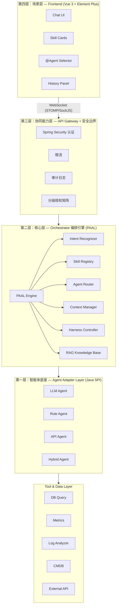
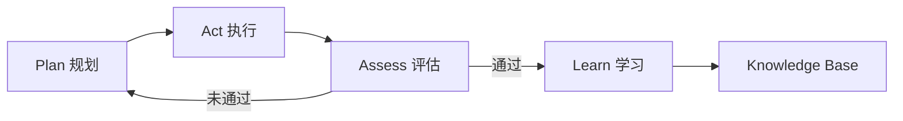
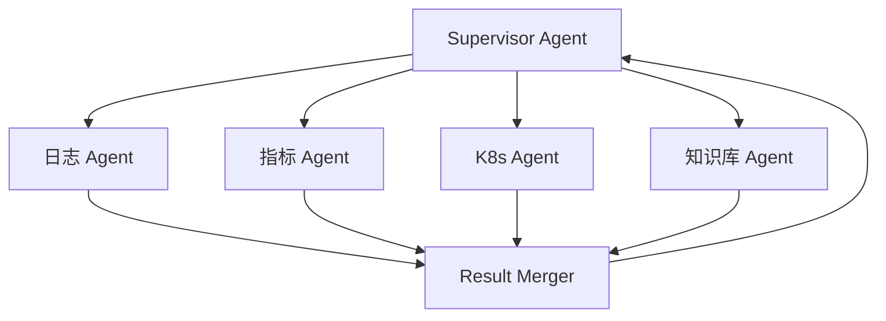
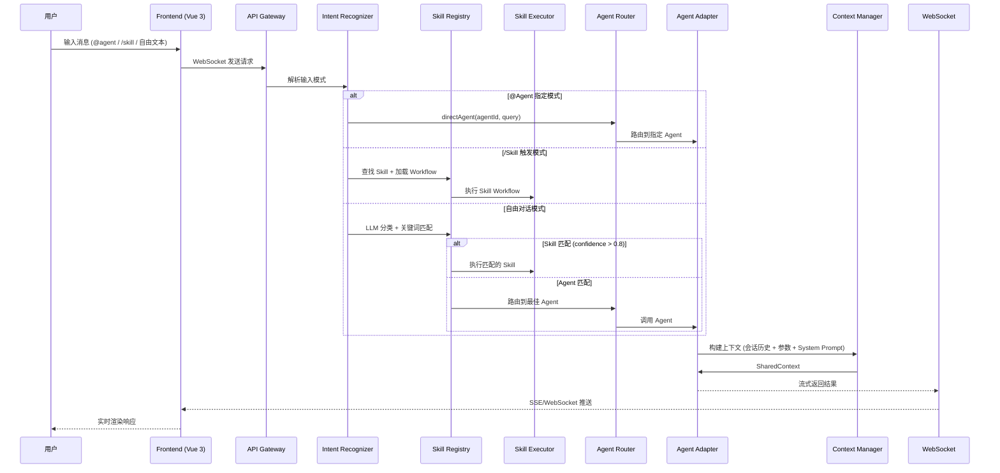
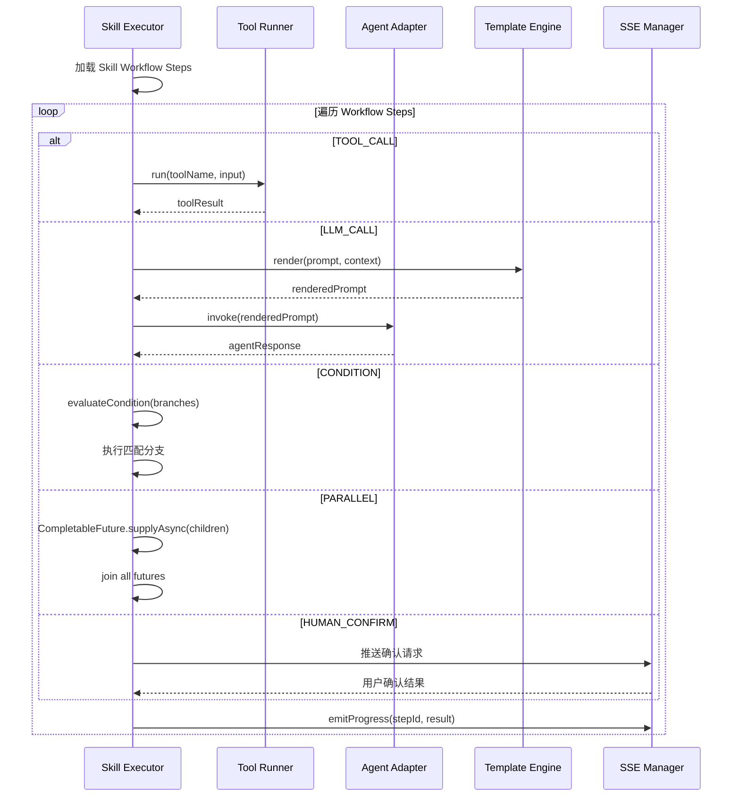
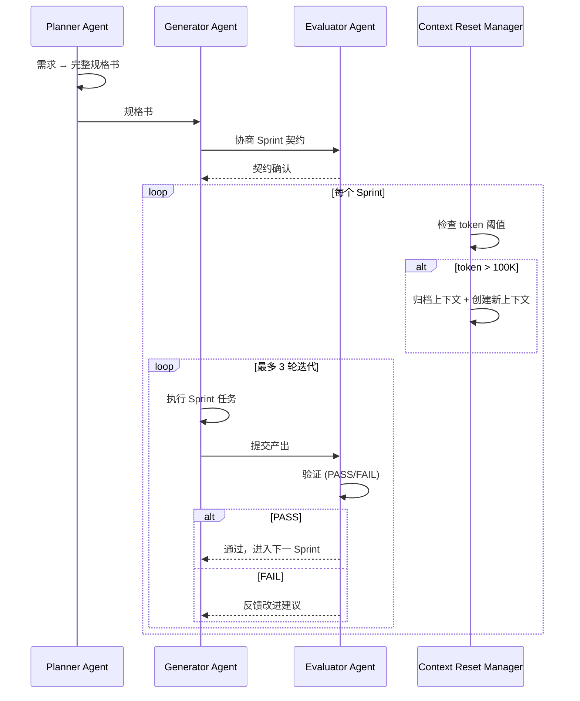

# Design Document: 多智能体编排平台 (Multi-Agent Orchestration Platform)

## Overview

多智能体编排平台是一个支持对话式交互的智能运维平台，融合信通院 SRE Agent 四层参考模型、PAAL 循环引擎和 Anthropic Harness 框架。平台以 Skill 为中心组织能力，以 Agent 为执行单元，以 PAAL 循环为驱动引擎，支持自由对话、技能触发、@Agent 指定路由和历史对话管理四种核心交互模式。

前端采用 Vue 3 + Element Plus 构建对话式 UI，后端基于 Spring Boot 3 + Spring WebFlux 实现响应式编排引擎，通过 WebSocket (STOMP/SockJS) 实现流式通信。系统通过 Java SPI 机制实现 Agent 可插拔，支持 LLM Agent、Rule Agent、API Agent 和 Hybrid Agent 四种类型，并通过 Harness 框架（双 Agent 博弈 + 三代理协作）保障长程任务质量。

## Architecture

### 信通院四层参考模型 + Harness 增强



### PAAL 循环引擎



### Multi-Agent 协同：主管 + 专家模式




## Sequence Diagrams

### 请求处理主流程



### Skill 执行引擎流程



### Harness 三代理协作流程



## Components and Interfaces

### Component 1: Intent Recognizer (意图识别器)

**Purpose**: 解析用户输入，识别交互模式（@Agent 指定 / /Skill 触发 / 自由对话），路由到对应处理链路。

```java
public interface IntentRecognizer {
    RoutingDecision recognize(String input, ConversationContext context);
}

public enum RoutingMode {
    DIRECT_AGENT,  // @agent-name 指定
    SKILL,         // /skill-name 触发
    AGENT          // 自由对话智能路由
}

@Data
@Builder
public class RoutingDecision {
    private RoutingMode mode;
    private String agentId;
    private String skillId;
    private String query;
    private Map<String, Object> params;
}
```

**Responsibilities**:
- 解析 `@agent-name` 显式指令，直接路由到指定 Agent
- 解析 `/skill-name` 指令，查找 Skill 并提取参数
- 自由文本通过 LLM 分类 + 关键词匹配进行智能路由
- 置信度 > 0.8 时匹配 Skill，否则路由到最佳 Agent

### Component 2: Skill Registry (技能注册中心)

**Purpose**: 管理 Skill 的注册、发现、匹配，支持 YAML 声明式配置和运行时热加载。

```java
public interface SkillRegistry {
    void register(Skill skill);
    List<ScoredSkill> match(String query, int topK);
    List<Skill> listByCategory(SkillCategory category);
    Skill getById(String skillId);
}
```

**Responsibilities**:
- 基于向量索引的语义匹配（Embedding + VectorStore）
- 按分类获取 Skill 列表（供前端卡片展示）
- 配合 Nacos 实现运行时热加载新 Skill
- Skill 配置通过 YAML + Git 管理，版本化可审计

### Component 3: Skill Executor (技能执行引擎)

**Purpose**: 按 Skill Workflow 定义的步骤顺序执行，支持 TOOL_CALL、LLM_CALL、CONDITION、PARALLEL、HUMAN_CONFIRM 五种步骤类型。

```java
public interface SkillExecutor {
    SkillResult execute(Skill skill, Map<String, Object> params, SharedContext context);
}
```

**Responsibilities**:
- 按 Workflow 步骤顺序执行，支持条件分支和并行执行
- 流式推送中间进度（通过 SSE Manager）
- 模板引擎渲染 LLM Prompt（注入参数和上下文）
- 人工确认步骤暂停等待用户响应

### Component 4: Agent Adapter Layer (智能体适配层)

**Purpose**: 通过 Java SPI 机制统一不同类型 Agent 的调用协议，实现 Agent 可插拔。

```java
public abstract class AgentAdapter {
    public abstract UnifiedResponse invoke(UnifiedRequest request);
    public abstract Flux<UnifiedChunk> stream(UnifiedRequest request);
    public abstract void cancel(String taskId);
    protected abstract Object toNativeFormat(UnifiedContext ctx);
    protected abstract UnifiedResponse fromNativeFormat(Object resp);
}
```

**Agent 类型**:
- `LLMAgentAdapter`: 调用大模型 (OpenAI/Claude/Qwen)
- `RuleAgentAdapter`: 基于规则引擎，不调用 LLM
- `APIAgentAdapter`: 直接调用外部 API 并格式化结果
- `HybridAgentAdapter`: 混合型，组合多种能力

### Component 5: PAAL Engine (PAAL 循环引擎)

**Purpose**: 实现 Plan-Act-Assess-Learn 闭环，每次 Skill 执行或 Agent 对话都遵循此循环。

```java
public interface PAALEngine {
    PAALResult run(PAALInput input, SharedContext context, int maxIterations);
}
```

**Responsibilities**:
- Plan: 分解任务，制定执行 DAG，引入 RAG 检索历史案例
- Act: 调用工具、Agent、API 执行操作
- Assess: 独立评估执行效果，判断是否达标
- Learn: 记录处置过程到知识库，优化后续决策

### Component 6: Harness Controller (Harness 框架控制器)

**Purpose**: 实现双 Agent 博弈和三代理协作，解决长程任务的上下文焦虑和自我评估偏差问题。

```java
public interface DualAgentExecutor {
    DualAgentResult execute(String task, SharedContext context, int maxRounds);
}

public interface FullHarnessExecutor {
    HarnessResult execute(String requirement, SharedContext context);
}
```

**Responsibilities**:
- 双 Agent 博弈: Generator 生成 → Evaluator 评估 → 迭代优化
- 三代理协作: Planner 规格书 → Generator+Evaluator 协商 Sprint 契约 → 逐 Sprint 迭代
- 上下文重置: token 超阈值时归档 + 干净重启，注入摘要继承关键上下文

### Component 7: Context Manager (上下文管理器)

**Purpose**: 构建发送给 Agent 的上下文，管理会话历史、长期记忆和跨会话检索。

```java
public interface ContextManager {
    SharedContext buildContext(Conversation conversation, RoutingDecision routing, AgentManifest agent);
    void persist(Conversation conversation, Object result);
}
```

**Responsibilities**:
- 截取最近 N 轮对话（避免 token 超限）
- Skill 模式注入 Skill 专属 system prompt
- 从向量库检索跨会话长期记忆
- 对话结束后摘要存入向量库

### Component 8: RAG Knowledge Service (RAG 知识库服务)

**Purpose**: 提供知识检索和写入能力，支持向量检索 + ReRank + 时间衰减。

```java
public interface RAGKnowledgeService {
    List<KnowledgeFragment> retrieve(String query, RAGConfig config);
    void ingest(KnowledgeEntry entry);
}
```

**Responsibilities**:
- 向量检索粗筛 Top-N 候选
- 时间衰减：近期知识权重更高
- ReRank 交叉编码器精排
- PAAL Learn 阶段自动写入处置经验

### Component 9: Authorization Gate (分级授权网关)

**Purpose**: 在 Agent 执行操作前，根据风险等级进行授权检查。

```java
public interface AuthorizationGate {
    AuthResult authorize(ToolCallRequest request, SharedContext context);
}

public enum RiskLevel {
    L1_READ_ONLY,   // 自动执行
    L2_LOW_RISK,    // 自动执行 + 事后通知
    L3_MEDIUM_RISK, // 需人工确认
    L4_HIGH_RISK    // 沙箱预演 + 多人审批
}
```

### Component 10: Fallback Executor (容错执行器)

**Purpose**: 构建 Agent 降级链，当主 Agent 失败时自动切换到备选 Agent。

```java
public interface FallbackExecutor {
    UnifiedResponse execute(RoutingDecision routing, SharedContext context);
}
```

**Responsibilities**:
- 构建降级链: [primary, fallback1, fallback2, generic]
- 超时控制 (CompletableFuture + timeout)
- 质量门禁检查 (qualityGate)
- 所有 Agent 失败时返回兜底回复

## Data Models

### Skill (技能定义)

```java
@Data
public class Skill {
    private String id;                          // e.g. "disk-space-diagnose"
    private String name;                        // e.g. "磁盘空间分析"
    private String description;
    private String icon;
    private SkillCategory category;             // DIAGNOSE, OPTIMIZE, MONITOR, SECURITY
    private String agentId;                     // 技能绑定的 Agent
    private List<SkillParam> inputParams;       // 技能需要的输入参数
    private SkillWorkflow workflow;             // 技能执行的工作流
    private DisplayConfig display;
    private List<String> permissions;
    private RateLimitConfig rateLimit;
}

public enum SkillCategory {
    DIAGNOSE, OPTIMIZE, MONITOR, SECURITY
}

@Data
public class SkillParam {
    private String name;
    private ParamType type;                     // STRING, NUMBER, ENUM, INSTANCE_SELECTOR
    private boolean required;
    private Object defaultValue;
    private String description;
    private List<String> enumValues;
}

@Data
public class SkillWorkflow {
    private List<WorkflowStep> steps;
}

@Data
public class WorkflowStep {
    private String id;
    private StepType type;                      // TOOL_CALL, LLM_CALL, CONDITION, PARALLEL, HUMAN_CONFIRM
    private String toolName;
    private String prompt;
    private String condition;
    private List<Branch> branches;
    private List<WorkflowStep> children;        // parallel 子步骤
    private String outputKey;                   // 结果存入上下文的 key
}

public enum StepType {
    TOOL_CALL, LLM_CALL, CONDITION, PARALLEL, HUMAN_CONFIRM
}
```

**Validation Rules**:
- `id` 必须唯一，格式为 kebab-case
- `agentId` 必须引用已注册的 Agent
- `workflow.steps` 至少包含一个步骤
- `inputParams` 中 `required=true` 的参数在执行前必须提供
- CONDITION 类型步骤必须包含 `branches`
- PARALLEL 类型步骤必须包含 `children`

### Agent Manifest (Agent 注册信息)

```java
@Data
public class AgentManifest {
    private String id;
    private String name;                        // 展示名，如 "RDS 诊断专家"
    private String avatar;
    private AgentType type;                     // LLM, RULE, API, HYBRID
    private String platform;                    // openai, claude, qwen, custom
    private List<AgentCapability> capabilities;
    private AgentConfig config;
    private String fallbackAgentId;             // 降级到哪个 Agent
}

public enum AgentType {
    LLM, RULE, API, HYBRID
}

@Data
public class AgentCapability {
    private String domain;                      // e.g. "database-diagnose"
    private List<String> skills;                // 该 Agent 支持的 Skill ID 列表
    private double confidence;
}

@Data
public class AgentConfig {
    private String model;
    private Double temperature;
    private String systemPrompt;
    private List<String> tools;                 // 可调用的 Tool ID 列表
    private int maxConcurrency;
    private int timeoutMs;
}
```

**Validation Rules**:
- `id` 必须唯一
- `type` 决定使用哪个 AgentAdapter 实现
- `fallbackAgentId` 如果设置，必须引用已注册的 Agent
- `config.timeoutMs` 必须 > 0
- `capabilities.confidence` 范围 [0.0, 1.0]

### Conversation & Message (对话与消息)

```java
@Data
@TableName("conversation")
public class Conversation {
    private String id;
    private String userId;
    private String title;                       // 自动生成或用户自定义
    private LocalDateTime createdAt;
    private LocalDateTime updatedAt;
    @TableField(exist = false)
    private List<Message> messages;
    private String agentsUsedJson;              // JSON 序列化
    private String skillsUsedJson;
}

@Data
@TableName("message")
public class Message {
    private String id;
    private String conversationId;
    private MessageRole role;                   // USER, ASSISTANT, SYSTEM, TOOL
    private String content;
    private LocalDateTime timestamp;
    private String agentId;
    private String skillId;
    private String traceId;
    private String attachmentsJson;             // 图表、表格等富文本结果
}

public enum MessageRole {
    USER, ASSISTANT, SYSTEM, TOOL
}
```

**Validation Rules**:
- `conversationId` 外键关联 Conversation
- `role` 不能为空
- `content` 不能为空（TOOL 类型除外，可能只有 attachments）
- `traceId` 用于全链路追踪关联

### Unified Request/Response (统一请求/响应)

```java
@Data
@Builder
public class UnifiedRequest {
    private String input;
    private SharedContext context;
    private List<ToolDefinition> tools;
}

@Data
@Builder
public class UnifiedResponse {
    private String content;
    private Object data;
    private List<ToolCall> toolCalls;
    private UsageInfo usage;
}

@Data
@Builder
public class UnifiedChunk {
    private String type;        // content, progress, done, error
    private String content;
    private Object data;
}

@Data
@Builder
public class SharedContext {
    private String sessionId;
    private String systemPrompt;
    private List<Message> messages;
    private List<MemoryFragment> longTermMemory;
    private Map<String, Object> currentParams;
    private List<String> feedbacks;
    private List<Object> intermediateResults;
}
```

### Request Trace (请求追踪)

```java
@Data
@Builder
public class RequestTrace {
    private String traceId;
    private String userId;
    private String conversationId;
    private String input;
    private RoutingDecision routing;
    private List<AgentCallTrace> agentCalls;
    private List<ToolCallTrace> toolCalls;
    private long totalLatencyMs;
    private String finalResponse;
}

@Data
@Builder
public class AgentCallTrace {
    private String agentId;
    private long latencyMs;
    private int inputTokens;
    private int outputTokens;
    private BigDecimal cost;
    private boolean success;
    private String error;
}

@Data
@Builder
public class ToolCallTrace {
    private String toolName;
    private long latencyMs;
    private boolean success;
}
```

## Key Functions with Formal Specifications

### Function 1: IntentRecognizer.recognize()

```java
RoutingDecision recognize(String input, ConversationContext context)
```

**Preconditions:**
- `input` 非空且非空白字符串
- `context` 非空，包含有效的会话 ID

**Postconditions:**
- 返回非空 `RoutingDecision`，`mode` 字段必须有值
- 若 `input` 以 `@` 开头，`mode == DIRECT_AGENT` 且 `agentId` 非空
- 若 `input` 以 `/` 开头，`mode == SKILL` 且 `skillId` 非空
- 否则 `mode == SKILL`（confidence > 0.8）或 `mode == AGENT`
- 不修改 `context` 的状态

### Function 2: SkillExecutor.execute()

```java
SkillResult execute(Skill skill, Map<String, Object> params, SharedContext context)
```

**Preconditions:**
- `skill` 非空且 `workflow.steps` 至少包含一个步骤
- `params` 包含 `skill.inputParams` 中所有 `required=true` 的参数
- `context` 非空且 `sessionId` 有效
- `skill.agentId` 引用的 Agent 已注册且可用

**Postconditions:**
- 返回非空 `SkillResult`，包含所有步骤的执行结果
- 每个步骤的 `outputKey` 对应的结果已写入 results map
- 所有中间进度已通过 SSE 推送
- CONDITION 步骤只执行匹配的分支
- PARALLEL 步骤的所有子步骤均已完成

**Loop Invariants:**
- 遍历 steps 时，`results` map 包含所有已执行步骤的输出
- 每个步骤执行后，SSE 进度已推送

### Function 3: PAALEngine.run()

```java
PAALResult run(PAALInput input, SharedContext context, int maxIterations)
```

**Preconditions:**
- `input` 非空且包含有效的任务描述
- `context` 非空
- `maxIterations` > 0

**Postconditions:**
- 若某轮 Assess 通过，返回 `PAALResult.success(output, assessment)`
- 若所有轮次均未通过，返回 `PAALResult.failed("超过最大迭代次数")`
- 无论成功失败，Learn 阶段都已将记录写入知识库
- 每轮未通过的反馈已注入下一轮 context

**Loop Invariants:**
- 每轮迭代中，`context.feedbacks` 包含所有之前轮次的评估反馈
- Plan → Act → Assess 顺序严格执行
- 迭代次数 ≤ `maxIterations`

### Function 4: DualAgentExecutor.execute()

```java
DualAgentResult execute(String task, SharedContext context, int maxRounds)
```

**Preconditions:**
- `task` 非空
- `context` 非空
- `maxRounds` > 0
- "generator-agent" 和 "evaluator-agent" 均已注册

**Postconditions:**
- 若 Evaluator 输出包含 "PASS"，返回 `DualAgentResult.passed(output, evaluation, rounds)`
- 若达到 maxRounds 仍未 PASS，返回 `DualAgentResult.maxRoundsReached(lastOutput, maxRounds)`
- Evaluator 从正确性、完整性、质量三个维度评分（1-10）
- 所有维度 ≥ 8 分时输出 PASS

**Loop Invariants:**
- 每轮 Generator 输出后，Evaluator 独立评估
- 未通过时，评估反馈注入下一轮 context

### Function 5: ContextManager.buildContext()

```java
SharedContext buildContext(Conversation conversation, RoutingDecision routing, AgentManifest agent)
```

**Preconditions:**
- `conversation` 非空且包含有效的 userId
- `routing` 非空
- `agent` 非空且 config 包含有效的 maxContextTokens

**Postconditions:**
- 返回的 `SharedContext` 包含截断后的最近 N 轮对话（不超过 maxContextTokens）
- 若 `routing.skillId != null`，systemPrompt 为 Skill 专属 prompt
- 否则 systemPrompt 为 Agent 默认 prompt
- `longTermMemory` 包含从向量库检索的 Top-5 相关历史

### Function 6: AuthorizationGate.authorize()

```java
AuthResult authorize(ToolCallRequest request, SharedContext context)
```

**Preconditions:**
- `request` 非空且包含有效的工具调用信息
- `context` 非空且包含用户身份信息

**Postconditions:**
- L1 只读操作：直接返回 approved
- L2 低危操作：返回 approved + 记录审计日志 + 发送通知
- L3 中危操作：等待人工审批，返回 approved 或 denied
- L4 高危操作：先沙箱预演，通过后提交多人审批
- 所有操作均记录审计日志

### Function 7: FallbackExecutor.execute()

```java
UnifiedResponse execute(RoutingDecision routing, SharedContext context)
```

**Preconditions:**
- `routing` 非空且 `agentId` 有效
- `context` 非空

**Postconditions:**
- 按降级链 [primary, fallback1, fallback2, generic] 顺序尝试
- 第一个通过 qualityGate 的结果被返回
- 若所有 Agent 失败，返回兜底回复 "抱歉，当前服务繁忙..."
- 每次失败记录 warn 日志

### Function 8: RAGKnowledgeService.retrieve()

```java
List<KnowledgeFragment> retrieve(String query, RAGConfig config)
```

**Preconditions:**
- `query` 非空
- `config.topK` > 0

**Postconditions:**
- 返回列表大小 ≤ `config.maxFragments`
- 结果按 score 降序排列（经过时间衰减和 ReRank）
- 无重复片段
- 近期知识的权重高于远期知识（时间衰减因子）

## Algorithmic Pseudocode

### 请求处理主算法

```pascal
ALGORITHM processRequest(input, conversationContext)
INPUT: input: String (用户输入), conversationContext: ConversationContext
OUTPUT: response: UnifiedResponse

BEGIN
  ASSERT input IS NOT EMPTY
  ASSERT conversationContext IS NOT NULL

  // Step 1: 意图识别与路由
  routing ← IntentRecognizer.recognize(input, conversationContext)

  // Step 2: 获取 Agent 信息
  agent ← AgentRegistry.get(routing.agentId)

  // Step 3: 构建上下文
  context ← ContextManager.buildContext(conversationContext.conversation, routing, agent)

  // Step 4: 根据路由模式执行
  CASE routing.mode OF
    DIRECT_AGENT:
      response ← FallbackExecutor.execute(routing, context)

    SKILL:
      skill ← SkillRegistry.getById(routing.skillId)
      // 验证必填参数
      FOR EACH param IN skill.inputParams WHERE param.required DO
        ASSERT routing.params CONTAINS param.name
      END FOR
      response ← SkillExecutor.execute(skill, routing.params, context)

    AGENT:
      response ← FallbackExecutor.execute(routing, context)
  END CASE

  // Step 5: 持久化对话
  ContextManager.persist(conversationContext.conversation, response)

  // Step 6: 流式返回
  WebSocket.send(context.sessionId, response)

  RETURN response
END
```

### PAAL 循环算法

```pascal
ALGORITHM paalLoop(input, context, maxIterations)
INPUT: input: PAALInput, context: SharedContext, maxIterations: Integer
OUTPUT: result: PAALResult

BEGIN
  ASSERT input IS NOT NULL
  ASSERT maxIterations > 0

  result ← NULL

  FOR i ← 0 TO maxIterations - 1 DO
    // INVARIANT: context.feedbacks 包含前 i 轮的评估反馈

    // Plan: 分解任务，检索历史案例
    historyCases ← RAGKnowledgeService.retrieve(input.description, ragConfig)
    context.addKnowledge(historyCases)
    plan ← TaskPlanner.plan(input, context)

    // Act: 执行计划
    output ← SkillExecutor.executePlan(plan, context)

    // Assess: 独立评估
    assessment ← ResultAssessor.assess(output, input.expectation)

    IF assessment.isPassed() THEN
      result ← PAALResult.success(output, assessment)
      BREAK
    END IF

    // 未通过，注入反馈
    context.addFeedback(assessment.feedback)
  END FOR

  // Learn: 记录到知识库
  KnowledgeBase.record(input, plan, result)

  IF result IS NULL THEN
    RETURN PAALResult.failed("超过最大迭代次数仍未通过评估")
  END IF

  RETURN result
END
```

### 双 Agent 博弈算法

```pascal
ALGORITHM dualAgentBattle(task, context, maxRounds)
INPUT: task: String, context: SharedContext, maxRounds: Integer
OUTPUT: result: DualAgentResult

BEGIN
  ASSERT task IS NOT EMPTY
  ASSERT maxRounds > 0

  generator ← AgentRegistry.getAdapter("generator-agent")
  evaluator ← AgentRegistry.getAdapter("evaluator-agent")
  lastOutput ← NULL

  FOR round ← 0 TO maxRounds - 1 DO
    // INVARIANT: context.feedbacks 包含前 round 轮的评估反馈

    // Generator 执行
    IF round = 0 THEN
      genPrompt ← task
    ELSE
      genPrompt ← task + "\n上一轮评估反馈：\n" + context.lastFeedback
    END IF
    lastOutput ← generator.invoke(genPrompt, context)

    // Evaluator 独立评估 (正确性/完整性/质量 1-10)
    evalPrompt ← buildEvalPrompt(lastOutput, task)
    evaluation ← evaluator.invoke(evalPrompt, context)

    IF evaluation.content CONTAINS "PASS" THEN
      RETURN DualAgentResult.passed(lastOutput, evaluation, round + 1)
    END IF

    context.addFeedback(evaluation.content)
  END FOR

  RETURN DualAgentResult.maxRoundsReached(lastOutput, maxRounds)
END
```

### 上下文重置算法

```pascal
ALGORITHM checkAndResetContext(current)
INPUT: current: SharedContext
OUTPUT: context: SharedContext

BEGIN
  TOKEN_THRESHOLD ← 100000

  IF current.estimateTokenCount() < TOKEN_THRESHOLD THEN
    RETURN current
  END IF

  // 归档当前上下文
  archive ← ContextArchiver.archive(current)

  // 创建干净的新上下文
  fresh ← SharedContext.builder()
    .sessionId(current.sessionId)
    .systemPrompt(current.systemPrompt)
    .messages(EMPTY_LIST)
    .currentParams(current.currentParams)
    .build()

  // 注入归档摘要
  fresh.addSystemMessage(
    "你正在继续一个进行中的任务。以下是之前的进度摘要：\n"
    + archive.summary
    + "\n\n请基于此继续工作。"
  )

  RETURN fresh
END
```

### 分级授权算法

```pascal
ALGORITHM authorize(request, context)
INPUT: request: ToolCallRequest, context: SharedContext
OUTPUT: result: AuthResult

BEGIN
  level ← OperationClassifier.classify(request)

  CASE level OF
    L1_READ_ONLY:
      RETURN AuthResult.approved("只读操作，自动放行")

    L2_LOW_RISK:
      auditLog(request, context, "AUTO_APPROVED")
      notifyOps(request, context)
      RETURN AuthResult.approved("低危操作，自动执行")

    L3_MEDIUM_RISK:
      ticket ← ApprovalService.createAndWait(request, context, requiredApprovers: 1)
      IF ticket.isApproved() THEN
        RETURN AuthResult.approved("人工审批通过: " + ticket.approver)
      ELSE
        RETURN AuthResult.denied("人工审批拒绝: " + ticket.reason)
      END IF

    L4_HIGH_RISK:
      sandboxResult ← SandboxExecutor.dryRun(request)
      IF NOT sandboxResult.isSafe() THEN
        RETURN AuthResult.denied("沙箱预演失败: " + sandboxResult.reason)
      END IF
      ticket ← ApprovalService.createAndWait(request, context, requiredApprovers: 2)
      IF ticket.isApproved() THEN
        RETURN AuthResult.approved("沙箱通过 + 多人审批通过")
      ELSE
        RETURN AuthResult.denied("审批拒绝: " + ticket.reason)
      END IF
  END CASE
END
```

## Example Usage

### 示例 1: 自由对话 — 智能路由

```java
// 用户输入自由文本，系统自动识别意图并路由
String userInput = "帮我看看 cn-hangzhou 地域的磁盘使用情况";
ConversationContext ctx = conversationService.getContext(sessionId);

// 意图识别
RoutingDecision routing = intentRecognizer.recognize(userInput, ctx);
// routing.mode == SKILL, routing.skillId == "disk-space-diagnose"
// routing.params == {region: "cn-hangzhou"}

// 构建上下文并执行
SharedContext sharedCtx = contextManager.buildContext(ctx.getConversation(), routing, agent);
SkillResult result = skillExecutor.execute(skill, routing.getParams(), sharedCtx);
```

### 示例 2: @Agent 指定模式

```java
// 用户通过 @agent 指定处理者
String userInput = "@rds-diagnose-agent 分析一下最近的慢查询";
RoutingDecision routing = intentRecognizer.recognize(userInput, ctx);
// routing.mode == DIRECT_AGENT, routing.agentId == "rds-diagnose-agent"
// routing.query == "分析一下最近的慢查询"

UnifiedResponse response = fallbackExecutor.execute(routing, sharedCtx);
```

### 示例 3: /Skill 触发模式

```java
// 用户通过 /skill 命令触发
String userInput = "/disk-space-diagnose instanceId=rm-bp1234";
RoutingDecision routing = intentRecognizer.recognize(userInput, ctx);
// routing.mode == SKILL, routing.skillId == "disk-space-diagnose"
// routing.params == {instanceId: "rm-bp1234"}
```

### 示例 4: PAAL 循环执行

```java
// 复杂诊断任务通过 PAAL 循环执行
PAALInput input = PAALInput.builder()
    .description("CPU 使用率持续 > 90%，需要定位根因")
    .expectation("找到根因并给出修复建议")
    .build();

PAALResult result = paalEngine.run(input, sharedCtx, 3);
// 第 1 轮: Plan(检查进程) → Act(top命令) → Assess(未找到根因) → 继续
// 第 2 轮: Plan(检查连接池) → Act(查询连接数) → Assess(发现连接泄漏) → PASS
// Learn: 记录 "CPU飙升→连接池泄漏" 到知识库
```

### 示例 5: 前端 WebSocket 交互

```typescript
// composables/useChat.ts
const chatStore = useChatStore()

// 发送消息
await chatStore.sendMessage("帮我分析磁盘空间", undefined, undefined)

// @Agent 指定
await chatStore.sendMessage("分析慢查询", "rds-diagnose-agent", undefined)

// /Skill 触发
await chatStore.sendMessage(null, undefined, "disk-space-diagnose")

// WebSocket 接收流式响应
ws.onmessage = (event) => {
  const chunk = JSON.parse(event.data)
  switch (chunk.type) {
    case 'content':   appendToLastMessage(chunk.content); break
    case 'progress':  updateSkillProgress(chunk.skillId, chunk.stepId, chunk.data); break
    case 'done':      isStreaming.value = false; break
  }
}
```

### 示例 6: Skill YAML 配置

```yaml
id: disk-space-diagnose
name: 磁盘空间分析
description: 分析指定实例或地域的磁盘空间使用情况，给出优化建议
icon: disk
category: diagnose
agentId: rds-diagnose-agent
inputParams:
  - name: instanceId
    type: instance_selector
    required: false
  - name: region
    type: enum
    required: false
    enumValues: [cn-hangzhou, cn-shanghai, cn-beijing]
workflow:
  steps:
    - id: collect_metrics
      type: tool_call
      toolName: rds-disk-metrics
      outputKey: diskMetrics
    - id: analyze
      type: llm_call
      prompt: |
        根据以下磁盘使用数据，分析空间使用趋势并给出优化建议：
        {{diskMetrics}}
      outputKey: analysis
    - id: check_critical
      type: condition
      condition: diskMetrics.maxUsagePercent > 90
      branches:
        - when: "true"
          then:
            - id: alert
              type: tool_call
              toolName: send-alert
              outputKey: alertResult
```

## Correctness Properties

1. **路由确定性**: ∀ input, context: `recognize(input, context)` 返回的 `RoutingDecision.mode` 必须是 `DIRECT_AGENT`、`SKILL`、`AGENT` 之一，不存在未定义的路由模式。

2. **Skill 参数完整性**: ∀ skill, params: 若 `skill.inputParams` 中存在 `required=true` 的参数 p，则 `params` 必须包含 key p.name，否则执行前抛出 `MissingParameterException`。

3. **PAAL 终止性**: ∀ input, maxIterations: `paalLoop` 最多执行 `maxIterations` 轮后终止，且 Learn 阶段一定执行（无论成功失败）。

4. **降级链完整性**: ∀ routing: `FallbackExecutor` 的降级链至少包含一个 generic Agent，确保不会出现所有 Agent 都不可用且无兜底回复的情况。

5. **上下文 Token 安全**: ∀ context: `buildContext` 返回的 `messages` 总 token 数 ≤ `agent.config.maxContextTokens`。

6. **授权不可绕过**: ∀ toolCallRequest: 在 Agent 执行任何工具调用前，必须经过 `AuthorizationGate.authorize()` 检查，L3/L4 操作未经审批不可执行。

7. **双 Agent 独立性**: ∀ round: Evaluator 的评估不依赖 Generator 的内部状态，仅基于 Generator 的输出和原始任务要求进行评估。

8. **上下文重置一致性**: ∀ context: 重置后的新 context 包含归档摘要，且 `sessionId` 和 `systemPrompt` 与原 context 一致。

9. **消息顺序性**: ∀ conversation: `messages` 按 `timestamp` 严格递增排序，WebSocket 推送顺序与服务端生成顺序一致。

10. **幻觉检测覆盖**: ∀ agentOutput: 若输出与知识库已知事实矛盾，`HallucinationGuard.check()` 返回 `flagged` 状态。

## Error Handling

### Error Scenario 1: Agent 调用超时

**Condition**: Agent 在 `config.timeoutMs` 内未返回响应
**Response**: `CompletableFuture.orTimeout()` 抛出 `TimeoutException`
**Recovery**: FallbackExecutor 自动切换到降级链中的下一个 Agent

### Error Scenario 2: 所有 Agent 降级失败

**Condition**: 降级链中所有 Agent 均失败（超时/异常/质量不达标）
**Response**: 返回兜底回复 "抱歉，当前服务繁忙，请稍后重试或联系管理员。"
**Recovery**: 记录告警日志，通知运维团队

### Error Scenario 3: Skill 必填参数缺失

**Condition**: 用户触发 Skill 但未提供 `required=true` 的参数
**Response**: 前端弹出 `el-dialog` 参数表单，要求用户补充
**Recovery**: 用户填写后重新提交

### Error Scenario 4: WebSocket 连接断开

**Condition**: 网络异常导致 WebSocket 连接中断
**Response**: 前端自动重连（SockJS fallback 机制）
**Recovery**: 重连后恢复会话上下文，未送达的消息重新推送

### Error Scenario 5: PAAL 循环超过最大迭代次数

**Condition**: `maxIterations` 轮 Assess 均未通过
**Response**: 返回 `PAALResult.failed("超过最大迭代次数仍未通过评估")`
**Recovery**: Learn 阶段仍然记录失败案例到知识库，供后续优化

### Error Scenario 6: 高危操作沙箱预演失败

**Condition**: L4 操作在沙箱环境中执行失败或产生不安全结果
**Response**: 直接拒绝执行，返回 `AuthResult.denied("沙箱预演失败")`
**Recovery**: 记录详细日志，通知安全团队审查

### Error Scenario 7: 向量库检索异常

**Condition**: Milvus/Qdrant 服务不可用
**Response**: RAG 检索降级为空结果，Agent 在无知识增强的情况下执行
**Recovery**: 记录告警，不阻塞主流程

### Error Scenario 8: LLM 模型返回幻觉内容

**Condition**: Agent 输出与知识库已知事实矛盾
**Response**: `HallucinationGuard` 标记为 flagged，附带矛盾证据
**Recovery**: 触发双 Agent 博弈重新生成，或标记为需人工复核

## Testing Strategy

### Unit Testing Approach

- 意图识别器: 测试 `@agent`、`/skill`、自由文本三种模式的解析正确性
- Skill 执行引擎: 测试五种步骤类型（TOOL_CALL, LLM_CALL, CONDITION, PARALLEL, HUMAN_CONFIRM）的执行逻辑
- PAAL 引擎: 测试循环终止条件、反馈注入、Learn 阶段执行
- 授权网关: 测试 L1-L4 四个等级的授权逻辑
- 上下文管理: 测试 token 截断、长期记忆检索、Skill prompt 注入
- 降级执行器: 测试降级链构建、超时处理、兜底回复

### Property-Based Testing Approach

**Property Test Library**: jqwik (Java) + fast-check (TypeScript/Frontend)

**后端属性测试**:
- 路由确定性: 任意合法输入，`recognize()` 总是返回有效的 `RoutingDecision`
- PAAL 终止性: 任意 `maxIterations`，循环总是在有限步内终止
- 授权完整性: 任意 `ToolCallRequest`，授权检查总是返回明确的 approved/denied
- 降级链非空: 任意 Agent 配置，降级链至少包含一个可用 Agent

**前端属性测试**:
- 消息渲染: 任意 Message 数据，ChatMessageList 总是正确渲染
- 输入解析: 任意用户输入，InputArea 正确识别 `@`/`/` 前缀

### Integration Testing Approach

- 端到端对话流程: 用户输入 → 意图识别 → Agent 调用 → 流式返回 → 前端渲染
- Skill 全流程: YAML 加载 → 参数校验 → Workflow 执行 → 结果组装
- WebSocket 通信: 连接建立 → 消息发送 → 流式接收 → 断线重连
- PAAL 闭环: Plan → Act → Assess → Learn 全流程验证
- 双 Agent 博弈: Generator 生成 → Evaluator 评估 → 迭代优化

## Performance Considerations

- **流式响应**: 通过 WebSocket/SSE 实现逐字推送，首字延迟 < 500ms
- **并行执行**: Skill Workflow 中 PARALLEL 步骤使用 `CompletableFuture` 并行执行
- **Token 控制**: Context Manager 截断历史消息，确保不超过模型 token 限制
- **向量检索**: Milvus/Qdrant 支持毫秒级向量检索，RAG 检索延迟 < 100ms
- **缓存策略**: Redis 缓存 Skill 配置、Agent 注册信息，减少 DB 查询
- **连接池**: LLM 调用使用连接池，避免频繁建立 HTTP 连接
- **限流**: API Gateway 层限流，防止单用户过度消耗 LLM 资源
- **上下文重置**: 长程任务通过归档 + 重启避免 token 逼近上限时质量下降

## Security Considerations

- **分级授权矩阵**: L1-L4 四级操作风险分级，高危操作需沙箱预演 + 多人审批
- **Spring Security + JWT**: 统一认证鉴权，Token 过期自动刷新
- **审计日志**: 所有操作记录完整审计日志，支持回溯
- **幻觉治理三层防护**: 生成层 (RAG 注入) → 验证层 (Evaluator 交叉验证) → 执行层 (沙箱预演)
- **输入过滤**: 防止 Prompt Injection 攻击
- **数据隔离**: 用户间对话数据严格隔离，向量库按 userId 过滤
- **敏感操作通知**: L2+ 操作自动发送钉钉通知

## Dependencies

| 依赖 | 用途 | 版本建议 |
|------|------|---------|
| Vue 3 | 前端框架 | 3.4+ |
| Element Plus | UI 组件库 | 2.7+ |
| Pinia | 状态管理 | 2.1+ |
| highlight.js | 代码高亮 | 11.x |
| ECharts | 图表渲染 | 5.x |
| Spring Boot 3 | 后端框架 | 3.2+ |
| Spring WebFlux | 响应式编程 | 随 Spring Boot |
| Spring Security | 认证鉴权 | 随 Spring Boot |
| Spring AI | LLM 统一网关 | 1.0+ |
| MyBatis-Plus | ORM | 3.5+ |
| WebSocket (STOMP/SockJS) | 实时通信 | 随 Spring |
| MySQL | 会话持久化 | 8.0+ |
| Redis | 缓存 | 7.0+ |
| Milvus / Qdrant | 向量存储 | Milvus 2.3+ / Qdrant 1.7+ |
| RocketMQ / Kafka | 消息队列 | RocketMQ 5.x / Kafka 3.x |
| Nacos | 配置中心 | 2.3+ |
| SkyWalking / OpenTelemetry | 可观测性 | 最新稳定版 |
| Temporal | 工作流编排 | 1.22+ |
