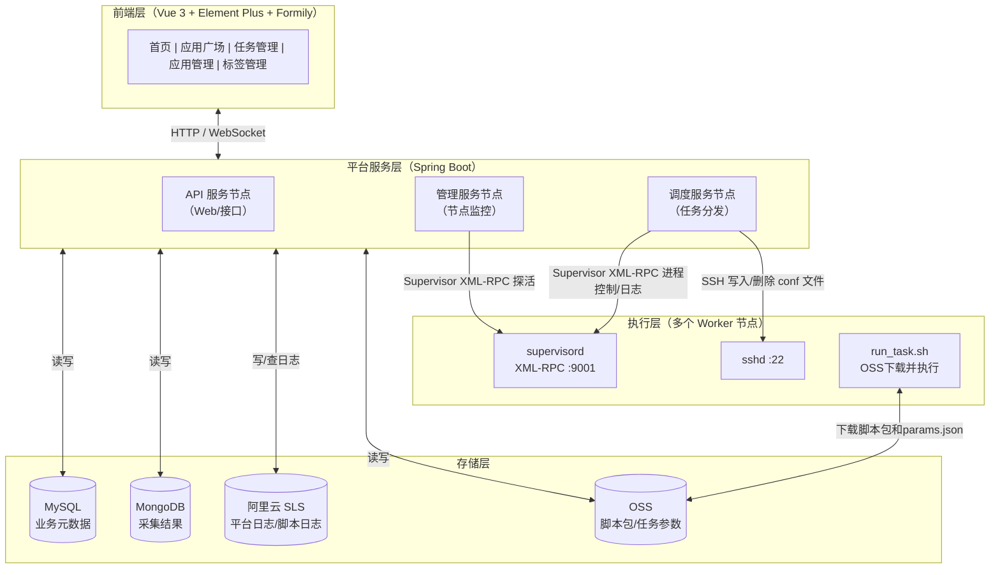
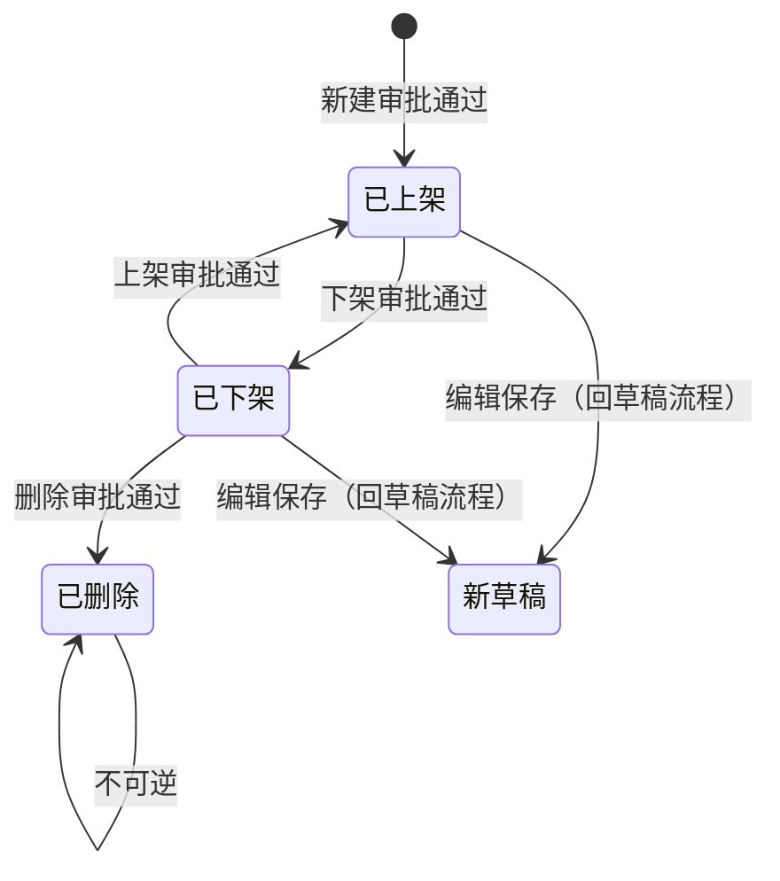
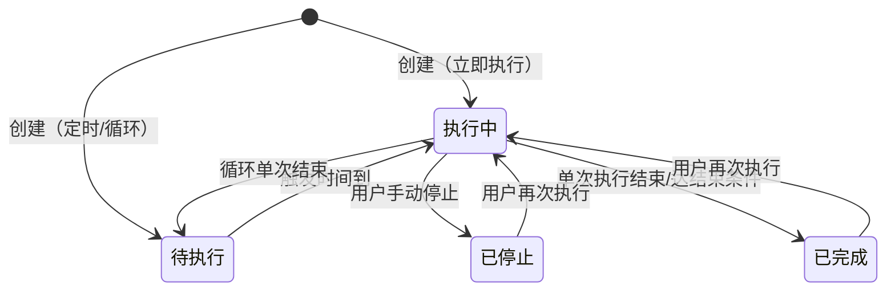
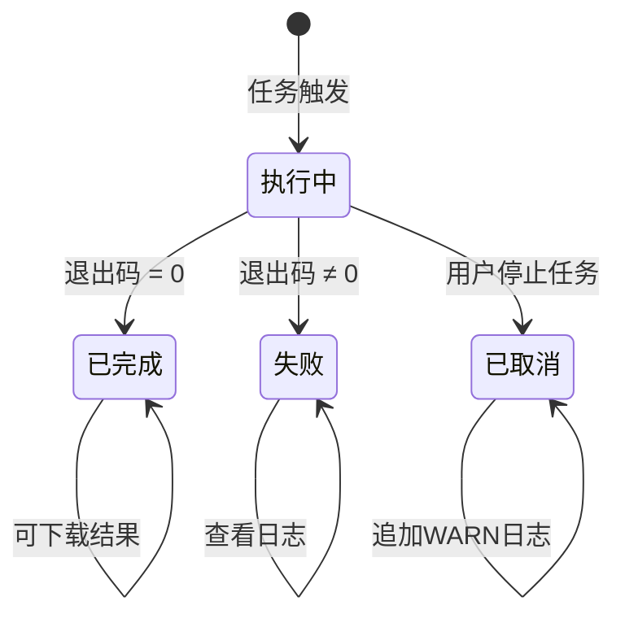
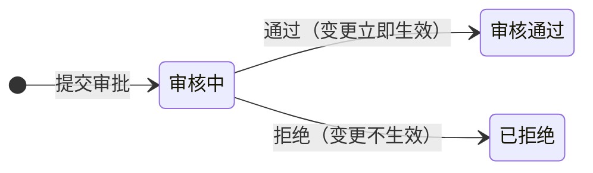
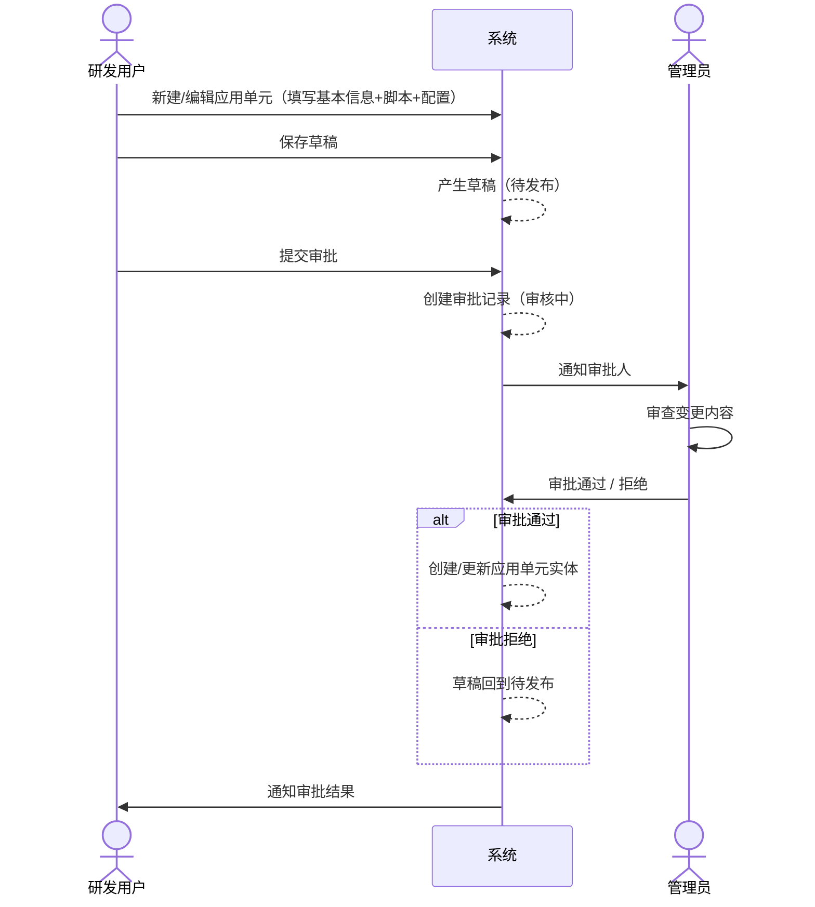
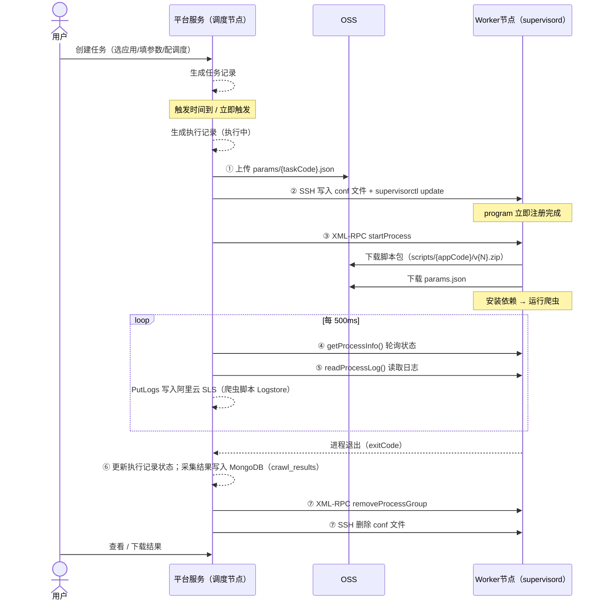

# 爬虫管理平台设计文档 v1.0

> 基于《采集平台一期需求文档v1.0》与《采集平台一期需求业务实体与业务流v1.0》整理。  
> 技术栈：`Spring Boot`、`Vue 3`、`Element Plus`、`Formily`、`MySQL`、`MongoDB`（采集结果）、`阿里云 OSS`、`阿里云日志服务 SLS`（平台服务日志 + 爬虫脚本执行日志）、`Supervisor`。  
> 部署形态：3 个服务节点 + 多个 Worker 工作节点。

---

## 目录

1. [背景与目标](#1-背景与目标)
2. [总体架构](#2-总体架构)
3. [核心业务实体](#3-核心业务实体)
4. [状态机设计](#4-状态机设计)
5. [核心业务流程](#5-核心业务流程)
6. [功能模块详细设计](#6-功能模块详细设计)
7. [数据库表结构（MySQL DDL）](#7-数据库表结构mysql-ddl)
8. [MongoDB 与阿里云 SLS 存储](#8-mongodb-与阿里云-sls-存储)
9. [后端 API 清单](#9-后端-api-清单)
10. [技术方案细节](#10-技术方案细节)
11. [非功能设计](#11-非功能设计)
12. [一期交付范围与里程碑](#12-一期交付范围与里程碑)

---

## 1. 背景与目标

### 1.1 背景问题

| 层面 | 问题描述 |
|------|----------|
| **管理层面** | 采集脚本、代码仓库、运行资源跟人走，缺乏统一管理机制与版本控制；人员变动后交接成本高 |
| **执行层面** | 脚本执行依赖开发人员本地或随机服务器，资源碎片化；采集过程依赖人工触发与监控，执行状态不透明，异常发现滞后 |
| **协作层面** | 新建采集任务缺少标准化流程，从启动任务到数据交付全生命周期各环脱节，缺乏统一查看管理入口 |

### 1.2 建设目标

围绕「**管得住、跑得稳**」两个核心诉求，一期聚焦：

- **脚本与代码统一部署管理**：提供应用单元的创建、配置、版本管理，将分散的采集脚本收敛到平台统一管控
- **采集任务产品化方案管理**：将采集任务的创建、调度、执行、结果查看全链路产品化，实现任务可配置、执行可追溯、结果可下载

### 1.3 一期功能范围

一期实现以下五大平台模块：

| 模块 | 说明 |
|------|------|
| **首页** | 数据大盘、快捷入口、数据获取流程引导 |
| **应用广场** | 浏览、搜索、筛选已上架爬虫应用 |
| **任务管理** | 创建、管理、执行、监控采集任务 |
| **应用管理** | 创建/编辑应用单元、脚本代码管理、审批流 |
| **标签管理** | 管理系统标签，用于分类应用单元 |

---

## 2. 总体架构

### 2.1 架构分层



### 2.2 节点职责划分

| 节点类型 | 数量 | 职责 |
|----------|------|------|
| **API 服务节点** | 1 | 提供全部 HTTP 接口，处理前端请求 |
| **调度服务节点** | 1 | 任务调度、分发、重试、防重叠控制；上传 params.json 到 OSS，SSH 写入 conf 到 Worker，调用 Supervisor 启动进程 |
| **管理服务节点** | 1 | 定时探活 Worker Supervisor（替代心跳）、依赖版本管理、审计日志 |
| **Worker 工作节点** | N（可扩展） | 仅运行 supervisord（XML-RPC 内网开放）和标准 sshd；零自研代码，平台 SSH 写 conf + XML-RPC 控制进程 |

### 2.3 技术选型对照

| 层面 | 选型 | 用途 |
|------|------|------|
| 后端框架 | Spring Boot | 业务逻辑、API 服务 |
| 前端框架 | Vue 3 + Element Plus | 管理平台 UI |
| 表单引擎 | 阿里 Formily | 应用参数配置动态渲染 |
| 关系型库 | MySQL | 业务元数据、状态、配置 |
| 文档库 | MongoDB | 采集结果（`crawl_results` 等结构化结果） |
| 日志服务 | 阿里云日志服务 SLS | 平台服务日志（API/审计/错误栈）+ 爬虫脚本 stdout/stderr 执行日志；按 Project / Logstore 拆分 |
| 对象存储 | 阿里云 OSS | 爬虫脚本包存储 + Worker conf 配置文件分发 |
| 进程管理 | Supervisor | Worker 节点进程拉起与监控（XML-RPC 内网开放，平台远程调用） |
| 远程操作 | JSch（Java SSH 客户端） | 平台直接 SSH 到 Worker 写入/删除 conf 文件，调用 supervisorctl |
| 依赖管理 | Python `requirements.txt` / Node `package.json` | 脚本运行环境依赖 |

---

## 3. 核心业务实体

### 3.1 应用单元（Application Unit）

应用单元是平台管理的核心资产，分为**草稿**和**实体**两个生命周期。

#### 草稿属性

| 属性名 | 必须 | 说明 |
|--------|------|------|
| 应用单元 ID | 是 | 系统唯一标识，创建后不可变 |
| 应用名称 | 是 | 展示名称，同用户下不可重复 |
| 应用标签 | 否 | 关联标签列表 |
| 应用描述 | 否 | 应用单元简介 |
| 交互配置 | 是 | 调用配置、Formily 参数定义（JSON Schema） |
| 爬虫脚本 | 是 | 脚本代码文件结构，存于 OSS |
| 状态 | 是 | 草稿状态：待发布 / 审批中 |
| 创建人/时间 | 是 | — |
| 更新人/时间 | 是 | — |

#### 实体属性（在草稿基础上增加）

| 属性名 | 必须 | 说明 |
|--------|------|------|
| 状态 | 是 | 已上架 / 已下架 / 已删除 |
| 版本号 | 是 | 每次审批通过后 +1，保留历史版本 |

### 3.2 任务（Task）

| 属性名 | 必须 | 说明 |
|--------|------|------|
| 任务 ID | 是 | 系统唯一标识 |
| 任务名称 | 是 | 同用户下不可重复 |
| 任务描述 | 否 | — |
| 所属应用 ID/名称/版本 | 是 | 关联应用单元及其配置快照版本 |
| 交互参数 | 是 | 用户填写的运行参数（基于 Formily Schema） |
| 调度类型 | 是 | 立即执行 / 定时单次 / 定时循环 |
| 任务类型 | 是 | 测试 / 正式 |
| 执行总次数 | 是 | — |
| 执行成功/失败次数 | 是 | — |
| 状态 | 是 | 待执行 / 执行中 / 已停止 / 已完成 |
| 创建人/时间 | 是 | — |

### 3.3 执行记录（Task Execution Record）

| 属性名 | 必须 | 说明 |
|--------|------|------|
| 执行 ID | 是 | 系统唯一标识 |
| 所属任务 ID | 是 | — |
| 序号 | 是 | 任务内倒序，最新最大 |
| 开始/结束时间 | 是/否 | 执行中时结束时间为空 |
| 耗时 | 否 | 结束时间 - 开始时间 |
| 状态 | 是 | 执行中 / 已完成 / 失败 / 已取消 |
| 结果条数 | 否 | 采集成功时的数据条数 |
| 执行日志 | — | 存于阿里云 SLS（爬虫脚本 Logstore），按 `execution_code` 等字段检索；平台侧增量拉取 Supervisor 日志后写入 SLS |

### 3.4 审批记录（Approval）

| 属性名 | 类型 | 必须 | 说明 |
|--------|------|------|------|
| 审批编号 | 字符串 | 是 | 系统自动生成：`APPROVAL-YYYYMMDD-XXX` |
| 应用单元 ID | 字符串 | 否 | 新建发布时为空 |
| 变更类型 | 枚举 | 是 | `create / edit / online / offline / delete` |
| 审批状态 | 枚举 | 是 | 审核中 / 审核通过 / 已拒绝 |
| 变更说明 | 字符串 | 是 | 提交人填写 |
| 提交人/时间 | — | 是 | — |
| 审批人/时间/意见 | — | 否 | 审批后填充 |

### 3.5 标签（Tag）

| 属性名 | 必须 | 说明 |
|--------|------|------|
| ID | 是 | 系统唯一标识 |
| 名称 | 是 | 同用户下不可重复 |
| 分类 | 否 | 业务场景 / 数据源类型 / 更新频率 等 |
| 颜色 | 否 | 展示色值 |
| 创建人/时间、更新人/时间 | 是 | — |

---

## 4. 状态机设计

### 4.1 应用单元（草稿）状态机


**核心规则：**
- 一个应用单元只有一份草稿，多人编辑保存直接覆盖，保留历史编辑记录
- 审批中的草稿禁止编辑，直到审批结束
- 审批通过 → 产生应用单元实体（初始已上架）；审批拒绝 → 草稿回到待发布

### 4.2 应用单元（实体）状态机



**核心规则：**
- 实体编辑审批通过 → 覆盖配置，版本 +1，实体状态不变
- 版本恢复 → 当前实体版本 +1，被恢复的历史版本不变
- 重新发布/下架**不影响**线上任务（参考 App 版本升级）
- 已上架不可直接删除，需先下架

### 4.3 任务状态机



**核心规则：**
- 测试任务：基于应用单元最新草稿创建，带「测试」标签，规则与正式任务一致
- 任务没有「失败」状态；脚本执行失败对应的是「执行记录失败」，任务本身进入「已完成」
- 同一任务同时只允许一条「执行中」记录，循环调度触发时若上一条仍在执行则自动跳过本轮

### 4.4 执行记录状态机



**操作权限矩阵：**

| 状态 | 查看日志 | 下载结果 | 备注 |
|------|----------|----------|------|
| 执行中 | ✓ | ✗ | — |
| 已完成 | ✓ | ✓（JSON/CSV/Excel） | — |
| 失败 | ✓ | ✗ | 通过任务级「再次执行」重新触发 |
| 已取消 | ✓ | ✗ | — |

### 4.5 审批状态机



**变更类型与通过效果：**

| 变更类型 | 触发场景 | 通过后效果 | 拒绝后效果 |
|----------|----------|------------|------------|
| `create` | 新建应用发布 | 创建应用单元（已上架） | 草稿回到待发布 |
| `edit` | 编辑/版本恢复发布 | 更新配置，版本 +1 | 草稿回到待发布 |
| `online` | 已下架 → 上架 | 已下架 → 已上架 | 状态不变（仍为已下架） |
| `offline` | 已上架 → 下架 | 已上架 → 已下架 | 状态不变（仍为已上架） |
| `delete` | 已下架 → 删除 | 已下架 → 已删除 | 状态不变（仍为已下架） |

---

## 5. 核心业务流程

### 5.1 应用上架流程



### 5.2 任务创建与执行流程



### 5.3 脚本代码工作台操作流程

```
研发用户
  │
  ├── 进入应用详情 → 脚本代码 Tab
  │     ├── 文件操作：新建文件/目录、导入、删除
  │     ├── 代码编辑：在线语法高亮编辑器，多 Tab 切换
  │     └── 保存：提交到服务端（OSS）
  │
  ├── 点击「运行」
  │     ├── 填写执行命令、附加参数、选择 Worker 节点
  │     └── 底部展开运行输出控制台（实时日志流）
  │
  └── 查看运行记录
        └── 右侧抽屉展示历史记录，点击展开日志
```

---

## 6. 功能模块详细设计

### 6.1 登录与首页

**登录页：**
- 一期无用户管理链路，仅提供登录页面
- 全量用户使用系统内置账号（预设手机号 + 任意 4 位验证码，DEMO 阶段）
- 一个账号涵盖所有角色

**首页：**
- 展示欢迎信息与数据大盘（任务成功率、采集总量等）
- 推荐应用快捷入口
- 数据获取流程引导：查找应用 → 配置任务 → 监控执行 → 获取数据（4 步）
- 菜单：首页、应用广场、任务管理、应用管理、标签管理（可点击）；其余菜单禁用

### 6.2 标签管理

- 标签列表：展示所有标签、分类、使用分布、使用次数
- 新建标签：名称、所属分类、颜色
- 标签分类：
  - **业务场景**：竞品分析、关键词搜索、企业信息、舆情监控、价格监控、电商采集、文档解析、批量处理、数据补全、OCR 识别
  - **数据源类型**：网页采集、API 接口、APP 采集
  - **更新频率**：实时、小时级、日级、一次性
- 预设标签为基础定义，不可删除；自定义标签由用户创建，可自由管理
- 建议优先使用预设标签保证一致性

### 6.3 应用管理

**应用列表：**
- 搜索（应用名称）、筛选（业务场景、数据源、快捷筛选：3个月/半年未使用）
- 列表字段：应用名称、状态（已上线/已废弃）、最近运行时间、执行统计、更新时间、标签、创建者
- 操作：下架、编辑、删除

**创建/编辑应用：**
- 基本信息：应用名称、应用标签（建议 1-3 个）、应用描述
- 注意：基本信息编辑与脚本/参数配置分离（详情页操作）

**应用详情（Tab 页）：**

| Tab | 功能 |
|-----|------|
| **概览** | 使用方法、注意事项、采集数据预览 |
| **脚本代码** | 代码在线编辑工作台（详见 6.4） |
| **参数配置** | Formily Schema 配置（详见 6.5） |
| **版本更新** | 历史版本列表，支持版本恢复 |
| **运行记录** | 该应用下所有测试运行记录 |
| **数据获取** | 数据下载入口 |

### 6.4 脚本代码工作台

**页面结构：**
- 顶部工具栏（两行）：
  - 第一行：标题面包屑 + 返回 + 保存草稿 + 提交审批
  - 第二行（左侧文件操作）：+文件、+目录、↑导入、删除（选中激活）、保存
  - 第二行（右侧）：▶ 运行、📋 运行记录
- 左侧文件树：支持文件/文件夹多选（Ctrl/Cmd+点击多选，Shift+点击范围选）
- 右侧代码编辑器：语法高亮、多文件 Tab 切换

**文件操作规则：**

| 操作 | 规则 |
|------|------|
| +文件 | 文件名仅支持英文字母、数字、下划线、中划线、点号；同名提示错误；创建后自动打开到编辑器 |
| +目录 | 目录名仅支持英文字母、数字、下划线、中划线；同名提示错误；默认展开 |
| ↑导入 | 打开系统文件选择器，支持多选；文件名冲突时覆盖；导入完成提示「已导入 X 个文件」 |
| 删除 | 未选中时置灰；选中后激活（红色）；删除文件夹同时删除所有子文件；二次确认 |
| 保存 | 保存所有已修改文件到服务端（OSS），展示「保存中...」→「已保存」 |

**运行对话框：**
- 执行命令（默认 `python {当前打开文件}`）、附加参数、执行节点（展示空闲/繁忙状态）

**运行输出控制台（底部展开）：**
- 日志格式：`[HH:MM:SS] [级别] 描述文字`
- 日志级别：`[INFO]`（灰蓝）/ `[DONE]`（绿）/ `[WARN]`（橙）/ `[ERROR]`（红）
- 状态 × 按钮交互：

| 状态 | 停止按钮 | 关闭按钮 |
|------|----------|----------|
| 运行中 | 红色可点击，终止脚本 | 可点击（先停止再关闭） |
| 运行完成 | 置灰 | 可点击 |
| 运行失败 | 置灰 | 可点击 |
| 已取消 | 置灰 | 可点击 |

**运行记录抽屉（680px）：**
- 按时间倒序，每页 5 条；支持文件名搜索 + 状态筛选
- 状态：执行中（蓝）/ 已完成（绿）/ 失败（红）/ 已取消（灰）
- 点击记录展开日志，日志每页 8 行

### 6.5 参数配置（Formily）

配置定义使用 JSON Schema（Formily 格式），支持动态渲染前端组件：

**支持组件：**
- 下拉框、输入框、文件上传、文本展示

**标签配置：**
- 左标签 / 顶部标签 / 行内标签 / 行下标签

**输入内容校验：**
- 配置内容校验、文本校验、小数校验、数字校验、非空校验、最大长度校验
- 每项值支持单独校验，未配置规则表示不校验

**执行配置字段示例：**
```json
{
  "appConfig": {
    "baseUrl": "https://api.example.com",
    "timeout": 30000,
    "retryCount": 3
  },
  "inputSchema": {
    "title": { "type": "string", "title": "标题", "default": "默认标题" },
    "keywords": { "type": "string", "title": "搜索关键词", "description": "多个关键词用英文逗号分隔" },
    "city": { "type": "string", "title": "城市", "default": "北京" },
    "dataFile": { "type": "file", "title": "CSV数据文件", "accept": ".csv" }
  }
}
```

### 6.6 应用广场

- 搜索（应用名称或描述）、筛选（业务场景、数据源类型）
- 支持「我的收藏」Tab
- 应用卡片：名称、标签、描述、最后更新时间、调用次数、「使用」按钮
- 点击「使用」进入应用详情或直接跳转任务创建

### 6.7 任务管理

**任务列表：**
- 搜索（任务名称/ID）、筛选（任务状态、任务类型、所属应用）
- 列表字段：任务名称/ID、所属应用（版本）、任务类型、调度策略、执行统计、最新执行时间、创建人/时间
- 操作：启动、停止、详情

**任务创建（4 步向导）：**

| 步骤 | 内容 |
|------|------|
| 1. 选择应用 | 选择爬虫应用单元 |
| 2. 填写参数 | 基于 Formily Schema 填写任务参数 |
| 3. 配置输出 | 输出格式（JSON/CSV/Excel）、存储方式（本地存储/DB 表）、是否启用推送 |
| 4. 确认创建 | 配置执行策略：立即执行/定时单次/定时循环（Cron）、禁止执行时间段 |

**执行记录与日志（任务详情内）：**
- 执行历史列表：执行次数、采集条数、执行时长、状态
- 执行日志：分页展示（每页 10 条预览）；支持全量导出
- 采集结果预览：表格展示（最多 10 条），支持全量导出

---

## 7. 数据库表结构（MySQL DDL）

```sql
CREATE DATABASE IF NOT EXISTS crawler_platform
  DEFAULT CHARACTER SET utf8mb4
  DEFAULT COLLATE utf8mb4_general_ci;

USE crawler_platform;

-- 标签
CREATE TABLE tag (
  id          BIGINT       PRIMARY KEY AUTO_INCREMENT           COMMENT '主键',
  tag_code    VARCHAR(64)  NOT NULL UNIQUE                      COMMENT '标签唯一编码，系统生成',
  tag_name    VARCHAR(64)  NOT NULL                             COMMENT '标签显示名称，同用户下不可重复',
  category    VARCHAR(32)  DEFAULT NULL                         COMMENT '标签分类：业务场景/数据源类型/更新频率',
  color       VARCHAR(16)  DEFAULT NULL                         COMMENT '标签色值（十六进制，如 #FF5733）',
  tag_type    TINYINT      NOT NULL DEFAULT 1                   COMMENT '标签类型：1=预设（不可删除），2=自定义',
  status      TINYINT      NOT NULL DEFAULT 1                   COMMENT '状态：1=启用，0=禁用',
  created_by  VARCHAR(64)  NOT NULL                             COMMENT '创建人',
  updated_by  VARCHAR(64)  NOT NULL                             COMMENT '最后更新人',
  created_at  DATETIME     NOT NULL DEFAULT CURRENT_TIMESTAMP   COMMENT '创建时间',
  updated_at  DATETIME     NOT NULL DEFAULT CURRENT_TIMESTAMP
              ON UPDATE CURRENT_TIMESTAMP                       COMMENT '最后更新时间'
) COMMENT='标签';

-- 应用单元（草稿与实体合表，draft_status/entity_status 区分生命周期）
CREATE TABLE app_unit (
  id              BIGINT       PRIMARY KEY AUTO_INCREMENT         COMMENT '主键',
  app_code        VARCHAR(64)  NOT NULL UNIQUE                    COMMENT '应用唯一编码，创建后不可变',
  app_name        VARCHAR(128) NOT NULL                           COMMENT '应用显示名称',
  description     VARCHAR(500) DEFAULT NULL                       COMMENT '应用简介',
  language        VARCHAR(16)  NOT NULL DEFAULT 'python'          COMMENT '脚本语言：python / node',
  oss_bucket      VARCHAR(64)  DEFAULT NULL                       COMMENT '脚本包所在 OSS Bucket',
  oss_script_key  VARCHAR(255) DEFAULT NULL                       COMMENT '当前草稿脚本包在 OSS 中的路径',
  script_sha256   VARCHAR(64)  DEFAULT NULL                       COMMENT '脚本包 SHA256 校验值，用于完整性验证',
  entry_command   VARCHAR(255) DEFAULT NULL                       COMMENT '默认执行命令，如 python main.py',
  form_schema     JSON         DEFAULT NULL                       COMMENT 'Formily JSON Schema，定义任务参数表单结构',
  usage_guide     MEDIUMTEXT   DEFAULT NULL                       COMMENT '使用方法（Markdown），应用详情-概览展示',
  precautions     MEDIUMTEXT   DEFAULT NULL                       COMMENT '注意事项（Markdown）',
  output_sample_json MEDIUMTEXT DEFAULT NULL                     COMMENT '采集数据 JSON 示例（合法 JSON 字符串）',
  output_field_docs JSON        DEFAULT NULL                     COMMENT '输出字段说明 JSON 数组：[{name,label,type,description,example}]',
  draft_status    TINYINT      NOT NULL DEFAULT 0                 COMMENT '草稿状态：0=待发布，1=审批中',
  entity_status   TINYINT      DEFAULT NULL                       COMMENT '实体状态：1=已上架，2=已下架，3=已删除；NULL 表示尚无实体',
  current_version INT          NOT NULL DEFAULT 0                 COMMENT '当前线上实体版本号，每次审批通过 +1',
  draft_version   INT          NOT NULL DEFAULT 1                 COMMENT '当前草稿版本号',
  created_by      VARCHAR(64)  NOT NULL                           COMMENT '创建人',
  updated_by      VARCHAR(64)  NOT NULL                           COMMENT '最后更新人',
  created_at      DATETIME     NOT NULL DEFAULT CURRENT_TIMESTAMP COMMENT '创建时间',
  updated_at      DATETIME     NOT NULL DEFAULT CURRENT_TIMESTAMP
                  ON UPDATE CURRENT_TIMESTAMP                     COMMENT '最后更新时间',
  INDEX idx_app_name (app_name),
  INDEX idx_app_entity_status (entity_status),
  INDEX idx_app_draft_status (draft_status)
) COMMENT='应用单元（草稿与实体合表）';

> **存量库升级**：若库已按旧 DDL 创建，可执行 `AppCrawlerPlatform/src/main/resources/db/alter_app_unit_overview.sql` 增加上述四列。

-- 应用单元版本历史
CREATE TABLE app_unit_version (
  id             BIGINT       PRIMARY KEY AUTO_INCREMENT         COMMENT '主键',
  app_id         BIGINT       NOT NULL                           COMMENT '关联 app_unit.id',
  version_no     INT          NOT NULL                           COMMENT '版本号，从 1 开始递增',
  oss_script_key VARCHAR(255) NOT NULL                           COMMENT '该版本脚本包在 OSS 中的路径',
  script_sha256  VARCHAR(64)  NOT NULL                           COMMENT '该版本脚本包 SHA256 校验值',
  entry_command  VARCHAR(255) DEFAULT NULL                       COMMENT '该版本的执行命令',
  form_schema    JSON         DEFAULT NULL                       COMMENT '该版本的 Formily JSON Schema 快照',
  change_log     VARCHAR(1000) DEFAULT NULL                      COMMENT '版本变更说明',
  created_by     VARCHAR(64)  NOT NULL                           COMMENT '发布人（审批通过时写入）',
  created_at     DATETIME     NOT NULL DEFAULT CURRENT_TIMESTAMP COMMENT '版本创建时间',
  UNIQUE KEY uk_app_ver (app_id, version_no),
  CONSTRAINT fk_app_ver FOREIGN KEY (app_id) REFERENCES app_unit(id)
) COMMENT='应用单元版本历史';

-- 应用单元与标签关联
CREATE TABLE app_tag_rel (
  id     BIGINT PRIMARY KEY AUTO_INCREMENT COMMENT '主键',
  app_id BIGINT NOT NULL                  COMMENT '关联 app_unit.id',
  tag_id BIGINT NOT NULL                  COMMENT '关联 tag.id',
  UNIQUE KEY uk_app_tag (app_id, tag_id)
) COMMENT='应用单元与标签关联';

-- 审批记录
CREATE TABLE approval_record (
  id              BIGINT       PRIMARY KEY AUTO_INCREMENT         COMMENT '主键',
  approval_no     VARCHAR(64)  NOT NULL UNIQUE                    COMMENT '审批编号，格式 APPROVAL-YYYYMMDD-XXX',
  app_id          BIGINT       DEFAULT NULL                       COMMENT '关联 app_unit.id；新建首次发布前为 NULL',
  app_name        VARCHAR(128) NOT NULL                           COMMENT '应用名称冗余存储，防止应用删除后丢失',
  change_type     VARCHAR(16)  NOT NULL                           COMMENT '变更类型：create/edit/online/offline/delete',
  approval_status TINYINT      NOT NULL DEFAULT 0                 COMMENT '审批状态：0=审核中，1=审核通过，2=已拒绝',
  change_desc     VARCHAR(1000) DEFAULT NULL                      COMMENT '提交人填写的变更说明',
  submitter       VARCHAR(64)  NOT NULL                           COMMENT '提交人',
  submit_time     DATETIME     NOT NULL DEFAULT CURRENT_TIMESTAMP COMMENT '提交时间',
  approver        VARCHAR(64)  DEFAULT NULL                       COMMENT '审批人，审批后填充',
  approve_time    DATETIME     DEFAULT NULL                       COMMENT '审批时间',
  approve_remark  VARCHAR(500) DEFAULT NULL                       COMMENT '审批意见（通过/拒绝原因）',
  INDEX idx_approval_app (app_id),
  INDEX idx_approval_status (approval_status),
  INDEX idx_approval_submit (submit_time)
) COMMENT='审批记录';

-- 采集任务
CREATE TABLE task (
  id                   BIGINT       PRIMARY KEY AUTO_INCREMENT         COMMENT '主键',
  task_code            VARCHAR(64)  NOT NULL UNIQUE                    COMMENT '任务唯一编码，系统生成',
  task_name            VARCHAR(128) NOT NULL                           COMMENT '任务显示名称，同用户下不可重复',
  task_desc            VARCHAR(500) DEFAULT NULL                       COMMENT '任务描述',
  task_type            TINYINT      NOT NULL DEFAULT 1                 COMMENT '任务类型：1=正式，2=测试',
  app_id               BIGINT       NOT NULL                           COMMENT '关联 app_unit.id',
  app_name             VARCHAR(128) NOT NULL                           COMMENT '应用名称冗余存储',
  app_version          INT          NOT NULL                           COMMENT '创建任务时绑定的应用版本号',
  form_data            JSON         NOT NULL                           COMMENT '用户填写的任务运行参数（基于 form_schema）',
  schedule_type        TINYINT      NOT NULL                           COMMENT '调度类型：1=立即执行，2=定时单次，3=定时循环',
  cron_expr            VARCHAR(64)  DEFAULT NULL                       COMMENT 'Cron 表达式，schedule_type=3 时必填',
  timezone             VARCHAR(64)  DEFAULT 'Asia/Shanghai'            COMMENT '调度时区',
  forbidden_time_ranges VARCHAR(500) DEFAULT NULL                      COMMENT '禁止执行时段，JSON 数组，格式 [{"start":"23:00","end":"06:00"}]',
  output_format        VARCHAR(16)  DEFAULT 'json'                     COMMENT '结果输出格式：json/csv/excel',
  output_storage       VARCHAR(32)  DEFAULT 'local'                    COMMENT '结果存储方式：local=平台内置存储，db=写入指定 DB 表',
  output_table_name    VARCHAR(128) DEFAULT NULL                       COMMENT '自定义 DB 表名，output_storage=db 时使用',
  push_enabled         TINYINT      NOT NULL DEFAULT 0                 COMMENT '是否启用结果推送：0=否，1=是',
  status               TINYINT      NOT NULL DEFAULT 0                 COMMENT '任务状态：0=待执行，1=执行中，2=已停止，3=已完成',
  execute_total        INT          NOT NULL DEFAULT 0                 COMMENT '累计触发执行次数',
  execute_success      INT          NOT NULL DEFAULT 0                 COMMENT '累计执行成功次数（退出码=0）',
  execute_fail         INT          NOT NULL DEFAULT 0                 COMMENT '累计执行失败次数（退出码≠0）',
  last_execute_time    DATETIME     DEFAULT NULL                       COMMENT '最近一次执行的开始时间',
  task_start_time      DATETIME     DEFAULT NULL                       COMMENT '任务首次启动时间',
  task_stop_time       DATETIME     DEFAULT NULL                       COMMENT '任务最后一次停止时间',
  created_by           VARCHAR(64)  NOT NULL                           COMMENT '创建人',
  created_at           DATETIME     NOT NULL DEFAULT CURRENT_TIMESTAMP COMMENT '创建时间',
  updated_at           DATETIME     NOT NULL DEFAULT CURRENT_TIMESTAMP
                       ON UPDATE CURRENT_TIMESTAMP                     COMMENT '最后更新时间',
  INDEX idx_task_app (app_id),
  INDEX idx_task_status (status),
  INDEX idx_task_type (task_type)
) COMMENT='采集任务';

-- Worker 节点
CREATE TABLE worker_node (
  id                   BIGINT      PRIMARY KEY AUTO_INCREMENT         COMMENT '主键',
  node_code            VARCHAR(64) NOT NULL UNIQUE                    COMMENT 'Worker 节点唯一编码，与 OSS conf 路径中的 nodeCode 对应',
  node_name            VARCHAR(128) NOT NULL                          COMMENT 'Worker 节点显示名称',
  ip                   VARCHAR(64) NOT NULL                           COMMENT 'Worker 节点内网 IP',
  supervisor_port      INT         NOT NULL DEFAULT 9001              COMMENT 'Supervisor XML-RPC 监听端口，默认 9001',
  supervisor_username  VARCHAR(64) NOT NULL                           COMMENT 'Supervisor XML-RPC 认证用户名',
  supervisor_password  VARCHAR(128) NOT NULL                          COMMENT 'Supervisor XML-RPC 认证密码（加密存储）',
  tags                 VARCHAR(255) DEFAULT NULL                      COMMENT '节点标签，逗号分隔，用于任务分配匹配',
  capacity             INT         NOT NULL DEFAULT 4                 COMMENT '最大并发槽位数（同时运行的任务上限）',
  used_slots           INT         NOT NULL DEFAULT 0                 COMMENT '当前已占用槽位数',
  status               TINYINT     NOT NULL DEFAULT 1                 COMMENT '节点状态：0=离线，1=在线，2=维护中',
  ssh_port             INT         NOT NULL DEFAULT 22                 COMMENT 'SSH 端口，默认 22',
  supervisor_version   VARCHAR(32) DEFAULT NULL                       COMMENT 'Supervisor 版本号，探活时写入',
  last_probe_at        DATETIME    DEFAULT NULL                       COMMENT '最近一次探活成功时间（替代心跳）',
  created_at           DATETIME    NOT NULL DEFAULT CURRENT_TIMESTAMP COMMENT '节点添加时间',
  updated_at           DATETIME    NOT NULL DEFAULT CURRENT_TIMESTAMP
                       ON UPDATE CURRENT_TIMESTAMP                    COMMENT '最后更新时间',
  INDEX idx_node_status (status),
  INDEX idx_node_probe (last_probe_at)
) COMMENT='Worker 节点';

-- 任务执行记录
CREATE TABLE execution_record (
  id               BIGINT        PRIMARY KEY AUTO_INCREMENT         COMMENT '主键',
  execution_code   VARCHAR(64)   NOT NULL UNIQUE                    COMMENT '执行唯一编码，格式 EXEC-YYYYMMDD-XXX，对应 Supervisor program 名及 OSS 路径',
  task_id          BIGINT        NOT NULL                           COMMENT '关联 task.id',
  sequence_no      INT           NOT NULL                           COMMENT '任务内执行序号，倒序（最新最大）',
  trigger_type     TINYINT       NOT NULL                           COMMENT '触发方式：1=调度自动触发，2=用户手工触发',
  status           TINYINT       NOT NULL DEFAULT 0                 COMMENT '执行状态：0=执行中，1=已完成，2=失败，3=已取消',
  worker_node_id   BIGINT        DEFAULT NULL                       COMMENT '关联 worker_node.id，记录本次执行分配到的节点',
  start_time       DATETIME      NOT NULL DEFAULT CURRENT_TIMESTAMP COMMENT '执行开始时间',
  end_time         DATETIME      DEFAULT NULL                       COMMENT '执行结束时间，执行中为 NULL',
  duration_ms      BIGINT        DEFAULT NULL                       COMMENT '执行耗时（毫秒），end_time - start_time',
  exit_code        INT           DEFAULT NULL                       COMMENT '进程退出码：0=正常，非 0=异常',
  log_read_offset  INT           NOT NULL DEFAULT 0                 COMMENT '平台已读取的日志字节偏移量，用于增量拉取 Supervisor 日志',
  result_count     INT           DEFAULT NULL                       COMMENT '采集结果数据条数，采集完成后写入',
  error_message    VARCHAR(1000) DEFAULT NULL                       COMMENT '失败原因摘要',
  mongo_result_ref VARCHAR(128)  DEFAULT NULL                       COMMENT 'MongoDB 采集结果文档的 execution_code 索引键',
  mongo_log_ref    VARCHAR(128)  DEFAULT NULL                       COMMENT 'SLS 侧日志关联键（建议与 execution_code 一致，供 Logstore 查询索引）；不再使用 MongoDB 存执行日志',
  created_at       DATETIME      NOT NULL DEFAULT CURRENT_TIMESTAMP COMMENT '记录创建时间',
  updated_at       DATETIME      NOT NULL DEFAULT CURRENT_TIMESTAMP
                   ON UPDATE CURRENT_TIMESTAMP                      COMMENT '最后更新时间',
  INDEX idx_exec_task (task_id),
  INDEX idx_exec_status (status),
  INDEX idx_exec_worker (worker_node_id),
  CONSTRAINT fk_exec_task FOREIGN KEY (task_id) REFERENCES task(id),
  CONSTRAINT fk_exec_worker FOREIGN KEY (worker_node_id) REFERENCES worker_node(id)
) COMMENT='任务执行记录';

-- 依赖包管理
CREATE TABLE dependency_package (
  id               BIGINT     PRIMARY KEY AUTO_INCREMENT         COMMENT '主键',
  dep_code         VARCHAR(64)  NOT NULL UNIQUE                  COMMENT '依赖包唯一编码',
  dep_name         VARCHAR(128) NOT NULL                         COMMENT '依赖包显示名称',
  language         VARCHAR(16)  NOT NULL                         COMMENT '适用语言：python / node',
  lock_content     MEDIUMTEXT   NOT NULL                         COMMENT '锁文件内容：requirements.txt 或 package-lock.json 全文',
  lock_sha256      VARCHAR(64)  NOT NULL                         COMMENT '锁文件 SHA256，用于判断内容是否变更',
  install_strategy TINYINT      NOT NULL DEFAULT 1               COMMENT '安装策略：1=在线安装（pip/npm），2=使用离线包',
  offline_oss_key  VARCHAR(255) DEFAULT NULL                     COMMENT '离线包在 OSS 中的路径，install_strategy=2 时使用',
  status           TINYINT      NOT NULL DEFAULT 1               COMMENT '状态：1=启用，0=停用',
  created_by       VARCHAR(64)  NOT NULL                         COMMENT '创建人',
  updated_by       VARCHAR(64)  NOT NULL                         COMMENT '最后更新人',
  created_at       DATETIME     NOT NULL DEFAULT CURRENT_TIMESTAMP COMMENT '创建时间',
  updated_at       DATETIME     NOT NULL DEFAULT CURRENT_TIMESTAMP
                   ON UPDATE CURRENT_TIMESTAMP                   COMMENT '最后更新时间',
  INDEX idx_dep_lang (language),
  INDEX idx_dep_status (status)
) COMMENT='依赖包定义';

-- 操作审计
CREATE TABLE operation_audit (
  id               BIGINT       PRIMARY KEY AUTO_INCREMENT         COMMENT '主键',
  operator         VARCHAR(64)  NOT NULL                           COMMENT '操作人',
  operation_type   VARCHAR(64)  NOT NULL                           COMMENT '操作类型，如 CREATE_APP/SUBMIT_APPROVAL/CREATE_TASK/RUN_TASK 等',
  biz_type         VARCHAR(32)  NOT NULL                           COMMENT '业务对象类型：app/task/execution/tag/approval',
  biz_id           VARCHAR(64)  NOT NULL                           COMMENT '业务对象 ID',
  request_payload  JSON         DEFAULT NULL                       COMMENT '操作请求体快照（脱敏后）',
  result_status    TINYINT      NOT NULL                           COMMENT '操作结果：1=成功，0=失败',
  result_message   VARCHAR(500) DEFAULT NULL                       COMMENT '操作结果说明或失败原因',
  created_at       DATETIME     NOT NULL DEFAULT CURRENT_TIMESTAMP COMMENT '操作时间',
  INDEX idx_audit_operator (operator),
  INDEX idx_audit_biz (biz_type, biz_id),
  INDEX idx_audit_time (created_at)
) COMMENT='操作审计';
```

---

## 8. MongoDB 与阿里云 SLS 存储

> **安全说明（必读）**  
> - 访问阿里云 API 的 **AccessKey ID / Secret 禁止写入代码仓库、设计文档正文或聊天中明文传播**；须使用 **RAM 子账号 + 最小权限策略**，通过 **环境变量 / 密钥管理服务（KMS）/ 容器密钥注入** 下发。  
> - 若密钥曾泄露，须立即在阿里云控制台 **停用并轮换**。  
> - 下文 **Project / Logstore 名称** 为环境配置项；**不包含任何账号密钥**。

### 8.1 采集结果集合：`crawl_results`（MongoDB）

```json
{
  "_id": "ObjectId",
  "execution_code": "EXEC-20240115-001",
  "task_id": 12345,
  "app_id": 67890,
  "items": [
    { "field1": "value1", "field2": "value2" }
  ],
  "total_count": 3000,
  "created_at": "ISODate"
}
```

**索引：**
- `execution_code`（唯一）
- `task_id + created_at`（复合）

### 8.2 日志：阿里云日志服务 SLS（替代原 MongoDB `execution_logs`）

执行过程 stdout/stderr、以及 Spring Boot 平台自身日志，**统一改为写入 SLS**，便于检索、投递、仪表盘与留存策略（TTL）。

#### 8.2.1 Logstore 划分

| 用途 | Project | Logstore | 说明 |
|------|---------|----------|------|
| **平台服务日志** | `hello-api-logs` | `hello-api-logstore` | API 服务、调度/管理服务、业务错误栈、慢查询、内部审计流水等（由平台进程写入） |
| **爬虫脚本执行日志** | `hello-spider-logs` | `hello-spider-logstore` | 自 Worker 进程采集的脚本输出：平台 `LogCollector` 经 Supervisor XML-RPC 增量读取后，按行或按批 `PutLogs` 写入本 Logstore |

> 配置项与代码侧建议映射：`platform.sls.api.project` / `platform.sls.api.logstore`、`platform.sls.spider.project` / `platform.sls.spider.logstore`（具体以工程 `application.yml` 为准）。

#### 8.2.2 爬虫脚本日志推荐字段（Spider Logstore）

写入时建议携带以下 **Key-Value**（便于 SQL 查询与仪表盘）：

| 字段 | 类型 | 说明 |
|------|------|------|
| `execution_code` | text | 与 `execution_record.execution_code` 一致，主检索维度 |
| `task_id` | long | 任务 ID |
| `app_id` | long | 应用 ID（可选） |
| `log_type` | text | 如 `stdout` / `stderr` |
| `level` | text | 解析后的级别：`INFO` / `WARN` / `ERROR` / `DONE` 等 |
| `message` | text | 单行日志正文 |
| `__time__` | 内置 | 日志时间（SLS 时间列） |

**索引建议：** 为 `execution_code`、`task_id` 建立索引；按需开启全文索引用于 `message` 检索。

#### 8.2.3 平台服务日志（API Logstore）

- 使用标准 Java 日志 Appender（如 **aliyun-log-logback-appender**）或 OpenTelemetry 导出至 SLS。  
- 建议字段：`service`、`env`、`traceId`（若接入链路）、`userId`、`path`、`status`、`latency_ms`、`error` 等。  
- 与爬虫脚本 **分 Project/Logstore**，避免查询混杂与权限边界不清。

#### 8.2.4 留存与成本

- 按环境配置 **日志存储时间**（例如生产 30～90 天）；冷热分层、投递 OSS 归档可按阿里云最佳实践选配。  
- 大量日志场景下，优先 **按 execution_code 查询** 与 **采样/分级**，避免全表扫 `message`。

#### 8.2.5 原 MongoDB `execution_logs` 集合

**一期起不再作为执行日志主存储**；若历史环境已有数据，可只读保留或迁移至 SLS 后下线该集合。

### 8.3 历史编辑记录集合：`app_draft_history`（MongoDB）

```json
{
  "_id": "ObjectId",
  "app_id": 67890,
  "editor": "zhangsan",
  "edit_time": "ISODate",
  "snapshot": {
    "form_schema": {},
    "oss_script_key": "scripts/xxx.zip",
    "entry_command": "python main.py"
  }
}
```

**索引：**
- `app_id + edit_time`（复合）

---

## 9. 后端 API 清单

> 统一响应格式：`{ code: 0, message: "ok", data: ... }`  
> 基础路径：`/api/v1`

### 9.1 标签管理

| 方法 | 路径 | 说明 |
|------|------|------|
| GET | `/tags` | 标签列表（支持分类筛选） |
| POST | `/tags` | 新建标签 |
| PUT | `/tags/{id}` | 更新标签 |
| DELETE | `/tags/{id}` | 删除自定义标签 |

### 9.2 应用单元管理

| 方法 | 路径 | 说明 |
|------|------|------|
| POST | `/apps` | 新建应用单元（产生草稿） |
| GET | `/apps` | 应用列表（支持搜索/筛选/分页） |
| GET | `/apps/{id}` | 应用详情（草稿 or 实体，由 `mode=draft/entity` 区分） |
| PUT | `/apps/{id}/draft` | 更新草稿（JSON Body，字段均可选、按需增量更新） |
| POST | `/apps/{id}/submit-approval` | 提交审批 |
| POST | `/apps/{id}/offline` | 提交下架审批 |
| POST | `/apps/{id}/online` | 提交上架审批 |
| DELETE | `/apps/{id}` | 提交删除审批 |
| GET | `/apps/{id}/versions` | 历史版本列表 |
| POST | `/apps/{id}/versions/{versionNo}/restore` | 版本恢复 |

**`PUT /apps/{id}/draft` 请求体（与一期实现对齐，除下表外仍支持 `appName`、`description`、`formSchema`、`entryCommand`、`tagIds`）：**

| 字段 | 类型 | 说明 |
|------|------|------|
| `usageGuide` | string | 使用方法，支持 Markdown；仅当 Body 含该 key 时更新 |
| `precautions` | string | 注意事项，Markdown |
| `outputSampleJson` | string | 采集结果 JSON 示例（整段合法 JSON 的字符串） |
| `outputFieldDocs` | string 或 JSON 数组 | 输出字段说明；可为 JSON 字符串，或为数组（服务端序列化入库） |

**应用详情页「概览」Tab 约定：**

- **使用方法 / 注意事项**：读写上述 Markdown 字段，供使用方阅读。
- **采集数据预览**：左侧展示 `outputSampleJson` 格式化结果；右侧列表由 `outputFieldDocs` 驱动（名称、类型、说明、示例）。
- **参数配置**：与 `form_schema` 同源；前端将表单项编辑结果写回 `formSchema`（Formily JSON Schema），任务创建页依赖该 Schema 渲染动态表单。

### 9.3 脚本代码工作台

| 方法 | 路径 | 说明 |
|------|------|------|
| GET | `/apps/{id}/files` | 获取文件树 |
| POST | `/apps/{id}/files` | 新建文件/目录 |
| PUT | `/apps/{id}/files` | 保存文件内容（批量） |
| DELETE | `/apps/{id}/files` | 删除文件/目录 |
| POST | `/apps/{id}/files/import` | 导入文件（multipart） |
| POST | `/apps/{id}/run` | 提交运行（测试运行） |
| GET | `/apps/{id}/run-records` | 运行记录列表（分页） |
| GET | `/apps/{id}/run-records/{recordId}/logs` | 运行日志（分页） |
| POST | `/apps/{id}/run-records/{recordId}/cancel` | 取消运行 |

### 9.4 审批管理

| 方法 | 路径 | 说明 |
|------|------|------|
| GET | `/approvals` | 审批列表（待审批/历史） |
| GET | `/approvals/{id}` | 审批详情 |
| POST | `/approvals/{id}/approve` | 通过审批（需填写意见） |
| POST | `/approvals/{id}/reject` | 拒绝审批（需填写原因） |

### 9.5 应用广场

| 方法 | 路径 | 说明 |
|------|------|------|
| GET | `/square/apps` | 已上架应用列表（搜索/筛选/分页） |
| GET | `/square/apps/{id}` | 应用详情（线上版本） |
| POST | `/square/apps/{id}/favorite` | 收藏/取消收藏 |

### 9.6 任务管理

| 方法 | 路径 | 说明 |
|------|------|------|
| POST | `/tasks` | 创建任务 |
| GET | `/tasks` | 任务列表（搜索/筛选/分页） |
| GET | `/tasks/{id}` | 任务详情 |
| POST | `/tasks/{id}/start` | 启动任务 |
| POST | `/tasks/{id}/stop` | 停止任务 |
| GET | `/tasks/{id}/executions` | 执行记录列表 |
| GET | `/tasks/{id}/executions/{execId}` | 执行记录详情 |
| GET | `/tasks/{id}/executions/{execId}/logs` | 执行日志（分页） |
| GET | `/tasks/{id}/executions/{execId}/result` | 采集结果（分页预览） |
| GET | `/tasks/{id}/executions/{execId}/download` | 下载结果（JSON/CSV/Excel） |

### 9.7 Worker 节点管理（平台内部接口）

> 采用 Supervisor XML-RPC 远程控制方案后，Worker 节点无需主动调用平台接口（无 register / heartbeat / pull / report）。以下接口均由**平台服务主动调用**，面向运维管理员操作。

| 方法 | 路径 | 说明 |
|------|------|------|
| POST | `/internal/workers` | 手动添加 Worker 节点（填写 IP、端口、认证信息） |
| PUT | `/internal/workers/{code}` | 更新 Worker 节点配置 |
| DELETE | `/internal/workers/{code}` | 下线并移除 Worker 节点 |
| GET | `/internal/workers` | Worker 节点列表（含在线状态、槽位占用） |
| POST | `/internal/workers/{code}/probe` | 手动触发一次探活（测试 Supervisor 连通性） |

### 9.8 依赖包管理

| 方法 | 路径 | 说明 |
|------|------|------|
| GET | `/dependencies` | 依赖包列表 |
| POST | `/dependencies` | 新建依赖包 |
| PUT | `/dependencies/{id}` | 更新依赖包 |
| GET | `/dependencies/{id}` | 依赖详情 |

### 9.9 错误码规范

| 错误码 | 含义 |
|--------|------|
| `0` | 成功 |
| `1001` | 参数校验失败 |
| `1002` | 资源不存在 |
| `1003` | 资源状态不允许当前操作（如审批中不可编辑） |
| `1004` | 无操作权限 |
| `2001` | 脚本包校验失败（SHA256 不一致） |
| `2002` | 依赖安装失败 |
| `2003` | 任务执行超时 |
| `2004` | Worker 节点不可用 |
| `2005` | Supervisor 启动失败 |
| `3001` | 日志存储（SLS）写入/查询失败 |
| `3002` | OSS 访问失败 |
| `3003` | MongoDB 写入失败（采集结果等） |
| `9000` | 系统内部异常 |

---

## 10. 技术方案细节

### 10.1 脚本存储方案（OSS + MySQL）

```
上传流程：
  前端 → 后端 API → 上传到 OSS（bucket/scripts/{appCode}/{version}.zip）
           │
           └─ 计算 SHA256 校验值
               写入 app_unit_version 表（version_no, oss_key, sha256）

执行流程：
  Worker 接收任务 → 根据 app_id + version_no 查询 oss_key
                  → 从 OSS 下载脚本包
                  → SHA256 校验
                  → 解压到本地工作目录
                  → Supervisor 执行 entry_command
```

### 10.2 环境依赖管理

- 所有执行节点统一 Python 版本、Node.js 版本
- 通过平台页面管理所有节点的 Python/Node 依赖包版本
- 节点扩缩容时自动适配所需依赖
- 依赖安装策略：
  - **在线安装**：pip/npm 直接安装（配置镜像源加速）
  - **离线包**：打包上传 OSS，节点本地缓存复用

### 10.3 Supervisor 进程管理

> **方案选型说明**：采用「Supervisor XML-RPC 内网暴露 + SSH 直接写入 conf」方案。Worker 节点无需部署任何业务代码，仅运行 `supervisord` 和标准 `sshd`；进程控制、状态查询、日志读取全部由平台服务通过 Supervisor XML-RPC 远程完成，conf 文件通过 SSH 直接写入。

#### 10.3.1 Worker 节点组件构成

每个 Worker 节点只有两个常驻系统服务和一个预装脚本，无任何自研业务代码：

| 组件 | 形式 | 端口 | 职责 |
|------|------|------|------|
| `supervisord` | 系统服务 | :9001 | 进程拉起与监控，XML-RPC 对内网开放 |
| `sshd` | 系统服务（标准） | :22 | 平台通过 SSH 直接写入/删除 conf 文件 |
| `run_task.sh` | 预装入口包装脚本 | — | 被 Supervisor 调用，从 OSS 下载脚本包和参数并执行 |

#### 10.3.2 Supervisor 配置（Worker 节点）

```ini
; /etc/supervisor/supervisord.conf

; ── XML-RPC 监听内网 IP（不对公网暴露）──
[inet_http_server]
port=10.0.0.x:9001          ; 替换为 Worker 节点内网 IP
username=crawler-platform
password=your_strong_password

[supervisord]
logfile=/var/log/supervisor/supervisord.log

[rpcinterface:supervisor]
supervisor.rpcinterface_factory = supervisor.rpcinterface:make_main_rpcinterface

[supervisorctl]
serverurl=http://10.0.0.x:9001

; ── 动态任务 conf 通过 include 加载（conf 文件由平台 SSH 写入）──
[include]
files = /etc/supervisor/conf.d/tasks/task-*.conf
```

#### 10.3.3 平台侧 WorkerSshClient（SSH 直接操作 Worker）

平台通过 JSch 库 SSH 到 Worker，直接写入/删除 conf 文件并触发 `supervisorctl update`。Worker 节点无需部署任何自研服务。

**Maven 依赖：**

```xml
<dependency>
    <groupId>com.github.mwiede</groupId>
    <artifactId>jsch</artifactId>
    <version>0.2.16</version>
</dependency>
```

**WorkerSshClient 实现：**

```java
@Component
@Slf4j
public class WorkerSshClient {

    private static final String CONF_DIR = "/etc/supervisor/conf.d/tasks/";

    // 平台统一使用一个 SSH 密钥对，私钥路径配置在 application.yml
    @Value("${worker.ssh.private-key-path}")
    private String privateKeyPath;

    @Value("${worker.ssh.username:crawler-admin}")
    private String sshUsername;

    /**
     * SSH 到 Worker，写入 conf 文件并执行 supervisorctl update
     */
    public void writeConfFile(WorkerNode worker, String programName, String confContent)
            throws Exception {
        String confPath = CONF_DIR + programName + ".conf";
        withSession(worker, session -> {
            // ① SFTP 写入 conf 文件
            ChannelSftp sftp = (ChannelSftp) session.openChannel("sftp");
            sftp.connect();
            sftp.put(new ByteArrayInputStream(confContent.getBytes(StandardCharsets.UTF_8)),
                    confPath, ChannelSftp.OVERWRITE);
            sftp.disconnect();

            // ② 执行 supervisorctl reread && update
            execCommand(session, "supervisorctl reread && supervisorctl update");
            log.info("[SSH] writeConfFile worker={} program={}", worker.getIp(), programName);
        });
    }

    /**
     * SSH 到 Worker，删除 conf 文件并执行 supervisorctl update
     */
    public void deleteConfFile(WorkerNode worker, String programName) throws Exception {
        String confPath = CONF_DIR + programName + ".conf";
        withSession(worker, session -> {
            execCommand(session, String.format(
                "[ -f '%s' ] && rm -f '%s'; supervisorctl reread && supervisorctl update",
                confPath, confPath));
            log.info("[SSH] deleteConfFile worker={} program={}", worker.getIp(), programName);
        });
    }

    // ── 内部工具方法 ─────────────────────────────────────────────────────────

    private void withSession(WorkerNode worker, SshAction action) throws Exception {
        JSch jsch = new JSch();
        jsch.addIdentity(privateKeyPath);
        Session session = jsch.getSession(sshUsername, worker.getIp(), worker.getSshPort());
        session.setConfig("StrictHostKeyChecking", "no");
        session.setTimeout(10_000);
        session.connect();
        try {
            action.execute(session);
        } finally {
            session.disconnect();
        }
    }

    private void execCommand(Session session, String command) throws Exception {
        ChannelExec exec = (ChannelExec) session.openChannel("exec");
        exec.setCommand(command);
        exec.connect();
        // 等待命令执行完成
        while (!exec.isClosed()) {
            Thread.sleep(100);
        }
        int exitCode = exec.getExitStatus();
        exec.disconnect();
        if (exitCode != 0) {
            throw new RuntimeException("SSH command failed, exitCode=" + exitCode + ", cmd=" + command);
        }
    }

    @FunctionalInterface
    interface SshAction {
        void execute(Session session) throws Exception;
    }
}
```

**application.yml 配置：**

```yaml
worker:
  ssh:
    private-key-path: /opt/platform/ssh/crawler_rsa  # 平台 SSH 私钥路径
    username: crawler-admin                           # Worker 节点 SSH 用户名
```

**Worker 节点初始化（一次性操作）：**

```bash
# 将平台公钥加入 Worker 的 authorized_keys
echo "ssh-rsa AAAA...platform_pubkey..." >> ~/.ssh/authorized_keys
chmod 600 ~/.ssh/authorized_keys

# 创建 conf 目录并赋予 SSH 用户写权限
mkdir -p /etc/supervisor/conf.d/tasks
chown crawler-admin:crawler-admin /etc/supervisor/conf.d/tasks
```

#### 10.3.4 run_task.sh 入口包装脚本

预装在每个 Worker 节点上（`/opt/crawler/run_task.sh`），所有执行参数均通过 Supervisor `environment=` 注入为环境变量。

**环境变量来源说明：**

| 环境变量 | 来源 DB 字段 | 说明 |
|----------|-------------|------|
| `EXECUTION_CODE` | `execution_record.execution_code` | 执行唯一编码，平台生成 |
| `OSS_BUCKET` | `app_unit.oss_bucket` | 脚本包所在 OSS Bucket |
| `OSS_SCRIPT_KEY` | `app_unit_version.oss_script_key`（按 `task.app_id` + `task.app_version` 查询） | 该版本脚本包在 OSS 的路径 |
| `SCRIPT_SHA256` | `app_unit_version.script_sha256` | 脚本包 SHA256，用于下载后完整性校验 |
| `ENTRY_COMMAND` | `app_unit_version.entry_command` | 脚本入口命令，如 `python main.py --params params.json` |
| `SCRIPT_LANGUAGE` | `app_unit.language` | 脚本语言：python / node，决定依赖安装方式 |
| `OSS_PARAMS_KEY` | 平台计算：`params/{taskCode}.json` | 任务运行参数文件在 OSS 的路径 |

**完整脚本：**

```bash
#!/bin/bash
set -e

# ── 从 Supervisor environment= 读取所有参数 ──────────────────────────────
EXEC_CODE="${EXECUTION_CODE}"          # 执行编码，用于工作目录命名和日志标识
BUCKET="${OSS_BUCKET}"                 # OSS Bucket 名称
OSS_KEY="${OSS_SCRIPT_KEY}"            # 脚本包 OSS 路径
EXPECTED_SHA256="${SCRIPT_SHA256}"     # 脚本包预期 SHA256
OSS_PARAMS_KEY="${OSS_PARAMS_KEY}"     # 任务参数文件 OSS 路径
ENTRY_CMD="${ENTRY_COMMAND}"           # 入口执行命令
LANGUAGE="${SCRIPT_LANGUAGE:-python}"  # 脚本语言，默认 python

# ── 准备工作目录 ──────────────────────────────────────────────────────────
WORK_DIR="/workspace/${EXEC_CODE}"
mkdir -p "${WORK_DIR}"
cd "${WORK_DIR}"

# ── 下载脚本包 ────────────────────────────────────────────────────────────
echo "[INFO] 下载脚本包：oss://${BUCKET}/${OSS_KEY}"
ossutil64 cp "oss://${BUCKET}/${OSS_KEY}" "./script.zip" -f -q

# ── SHA256 完整性校验 ─────────────────────────────────────────────────────
ACTUAL_SHA256=$(sha256sum script.zip | awk '{print $1}')
if [ "${ACTUAL_SHA256}" != "${EXPECTED_SHA256}" ]; then
    echo "[ERROR] 脚本包 SHA256 校验失败！期望=${EXPECTED_SHA256} 实际=${ACTUAL_SHA256}"
    exit 1
fi
echo "[INFO] SHA256 校验通过"

# ── 解压脚本包 ────────────────────────────────────────────────────────────
unzip -o script.zip -d .
rm -f script.zip

# ── 下载任务参数文件 ──────────────────────────────────────────────────────
echo "[INFO] 下载任务参数：oss://${BUCKET}/${OSS_PARAMS_KEY}"
ossutil64 cp "oss://${BUCKET}/${OSS_PARAMS_KEY}" "./params.json" -f -q

# ── 安装依赖 ──────────────────────────────────────────────────────────────
echo "[INFO] 安装依赖..."
if [ "${LANGUAGE}" = "python" ] && [ -f "requirements.txt" ]; then
    pip install -r requirements.txt -i https://mirrors.aliyun.com/pypi/simple/ -q
elif [ "${LANGUAGE}" = "node" ] && [ -f "package.json" ]; then
    npm install --quiet
fi

# ── 执行采集脚本 ──────────────────────────────────────────────────────────
echo "[INFO] 启动采集脚本：${ENTRY_CMD}"
eval "${ENTRY_CMD}"
```

**执行后工作目录结构：**

```
/workspace/EXEC-20240318-001/
├── params.json          ← 从 OSS 下载（task.form_data 序列化）
├── main.py              ← 从脚本包解压
├── requirements.txt     ← 从脚本包解压
└── utils/
    └── helper.py        ← 从脚本包解压
```

#### 10.3.5 OSS 完整目录结构

平台在 OSS 上的完整目录规划，仅包含**脚本版本**和**任务参数**两类文件。conf 文件由平台直接通过 Worker API 写入 Worker 本地，不再经过 OSS 中转。

```
oss://crawler-platform/
│
├── scripts/                                  # 爬虫脚本包（版本化存储）
│   └── {appCode}/
│       ├── draft.zip                         # 草稿包   → app_unit.oss_script_key
│       ├── v1.zip                            # 版本 1   → app_unit_version(version_no=1).oss_script_key
│       └── v{N}.zip                          # 版本 N   → app_unit_version(version_no=N).oss_script_key
│
└── params/                                   # 任务运行参数文件（任务级）
    └── {taskCode}.json                       # task.form_data 序列化
                                              # 同一任务多次执行共用，参数变更时覆盖
```

**各目录对应的读写方 & 时机：**

| OSS 路径 | 写入方 | 写入时机 | 读取方 | 读取时机 |
|----------|--------|----------|--------|----------|
| `scripts/{appCode}/draft.zip` | 平台 API | 工作台保存脚本 | `run_task.sh` | 测试运行时 |
| `scripts/{appCode}/v{N}.zip` | 平台 API | 审批通过生成新版本 | `run_task.sh` | 正式任务执行时 |
| `params/{taskCode}.json` | 调度服务 | 分发任务时（参数变更则覆盖） | `run_task.sh` | 脚本执行启动时 |

> conf 文件不经 OSS，由平台调度服务通过 SSH 直接写入 Worker 本地 `/etc/supervisor/conf.d/tasks/` 后立即执行 `supervisorctl update`，同步生效，无延迟。

#### 10.3.6 任务参数文件（params.json）的存储与分发

任务运行参数（`task.form_data`）需在执行时以文件形式传递给爬虫脚本，原因是 Supervisor `environment=` 字段对特殊字符（双引号、逗号、中文等）需要转义，嵌套 JSON 极易出错，改为 OSS 文件传递无任何限制。

**params.json 存储路径（按 taskCode，同一任务多次执行复用同一份）：**

```
OSS: params/{taskCode}.json
```

**分发时机：平台生成 conf 文件时同步上传**

```java
private String buildConfContent(String execCode, Task task, WorkerNode worker,
                                AppUnitVersion version) {
    // ── 各环境变量的数据来源 ──────────────────────────────────────────────

    // execution_record.execution_code → 工作目录命名、日志标识
    String executionCode = execCode;

    // app_unit.oss_bucket → 脚本包和参数文件所在 Bucket
    String ossBucket = version.getApp().getOssBucket();

    // app_unit_version.oss_script_key → 按 task.app_id + task.app_version 查询
    String ossScriptKey = version.getOssScriptKey();

    // app_unit_version.script_sha256 → 下载后完整性校验
    String scriptSha256 = version.getScriptSha256();

    // app_unit_version.entry_command → 脚本入口命令
    String entryCommand = version.getEntryCommand();

    // app_unit.language → 决定用 pip 还是 npm 安装依赖
    String scriptLanguage = version.getApp().getLanguage();

    // params 路径按 taskCode，同一任务多次执行共用，参数变更时覆盖
    String ossParamsKey = "params/" + task.getTaskCode() + ".json";

    // ── 生成 conf 文件内容 ────────────────────────────────────────────────
    String programName = "task-" + execCode;
    return String.format("""
            [program:%s]
            command=/opt/crawler/run_task.sh
            directory=/workspace/%s/
            autostart=false
            autorestart=false
            stopasgroup=true
            killasgroup=true
            stdout_logfile=/var/log/crawler/exec/%s.log
            stderr_logfile=/var/log/crawler/exec/%s_err.log
            environment=EXECUTION_CODE="%s",OSS_BUCKET="%s",OSS_SCRIPT_KEY="%s",SCRIPT_SHA256="%s",OSS_PARAMS_KEY="%s",ENTRY_COMMAND="%s",SCRIPT_LANGUAGE="%s"
            """,
            programName, execCode, execCode, execCode,
            executionCode, ossBucket, ossScriptKey, scriptSha256,
            ossParamsKey, entryCommand, scriptLanguage);
}

public ExecutionRecord dispatch(Task task, WorkerNode worker) throws Exception {
    // 查询任务绑定的版本
    AppUnitVersion version = appUnitVersionRepo.findByAppIdAndVersionNo(
            task.getAppId(), task.getAppVersion());

    ExecutionRecord record = executionRecordService.create(task, TriggerType.SCHEDULED);
    String execCode = record.getExecutionCode();

    // 生成 conf 内容
    String confContent  = buildConfContent(execCode, task, worker, version);
    String programName  = "task-" + execCode;

    // ① 上传 params.json 到 OSS（taskCode 路径，已存在则覆盖）
    String paramsJson   = objectMapper.writeValueAsString(task.getFormData());
    String paramsOssKey = "params/" + task.getTaskCode() + ".json";
    ossClient.upload(paramsOssKey, paramsJson);

    // ② SSH 到 Worker，写入 conf 文件并执行 supervisorctl update（同步，无延迟）
    workerSshClient.writeConfFile(worker, programName, confContent);

    // ③ conf 写入后 supervisorctl 已 update，program 已注册，直接 startProcess
    supervisorFactory.getClient(worker).startProcess(programName);

    workerNodeRepo.incrementUsedSlots(worker.getId());
    return record;
}
```


#### 10.3.7 平台生成的 conf 文件内容

平台为每次执行生成一个 conf 文件，OSS 路径为 `confs/task-{executionCode}.conf`，内容模板如下：

```ini
; confs/task-{executionCode}.conf
[program:task-{executionCode}]
command=/opt/crawler/run_task.sh
directory=/workspace/{executionCode}/
autostart=false
autorestart=false
stopasgroup=true
killasgroup=true
stdout_logfile=/var/log/crawler/exec/{executionCode}.log
stderr_logfile=/var/log/crawler/exec/{executionCode}_err.log
environment=EXECUTION_CODE="{executionCode}",
            OSS_BUCKET="{app_unit.oss_bucket}",
            OSS_SCRIPT_KEY="{app_unit_version.oss_script_key}",
            SCRIPT_SHA256="{app_unit_version.script_sha256}",
            OSS_PARAMS_KEY="params/{taskCode}.json",
            ENTRY_COMMAND="{app_unit_version.entry_command}",
            SCRIPT_LANGUAGE="{app_unit.language}"
```

所有执行参数通过环境变量注入 `run_task.sh`，conf 模板本身固定不变，差异完全由变量值体现。

#### 10.3.9 Java SupervisorClient（远程 XML-RPC）

与之前相同的 `SupervisorClient` 封装，区别在于 URL 指向 Worker 内网 IP 而非 `127.0.0.1`：

```java
@Component
public class SupervisorClientFactory {

    // 每个 Worker 节点对应一个独立的 SupervisorClient 实例
    private final Map<String, SupervisorClient> clientMap = new ConcurrentHashMap<>();

    public SupervisorClient getClient(WorkerNode worker) {
        return clientMap.computeIfAbsent(worker.getNodeCode(), k -> {
            String url = String.format("http://%s:%d/RPC2",
                    worker.getIp(), worker.getSupervisorPort());
            return new SupervisorClient(url,
                    worker.getSupervisorUsername(),
                    worker.getSupervisorPassword());
        });
    }

    // Worker 节点下线时清理客户端
    public void removeClient(String nodeCode) {
        clientMap.remove(nodeCode);
    }
}
```

#### 10.3.10 平台调度：完整执行流程

```java
@Service
@RequiredArgsConstructor
@Slf4j
public class TaskDispatchService {

    private final OssClient ossClient;
    private final WorkerSshClient workerSshClient;
    private final SupervisorClientFactory supervisorFactory;
    private final WorkerNodeRepository workerNodeRepo;
    private final ExecutionRecordService executionRecordService;
    private final AppUnitVersionRepository appUnitVersionRepo;
    private final ObjectMapper objectMapper;

    public ExecutionRecord dispatch(Task task, WorkerNode worker) throws Exception {
        // 查询任务绑定的应用版本（提供脚本路径、入口命令等信息给 buildConfContent）
        AppUnitVersion version = appUnitVersionRepo.findByAppIdAndVersionNo(
                task.getAppId(), task.getAppVersion());

        ExecutionRecord record = executionRecordService.create(task, TriggerType.SCHEDULED);
        String execCode = record.getExecutionCode();
        String programName = "task-" + execCode;

        // ① 上传 params.json 到 OSS（按 taskCode，同一任务多次执行共用）
        String paramsJson   = objectMapper.writeValueAsString(task.getFormData());
        String paramsOssKey = "params/" + task.getTaskCode() + ".json";
        ossClient.upload(paramsOssKey, paramsJson);

        // ② SSH 到 Worker，写入 conf 文件并执行 supervisorctl update（同步，立即生效）
        String confContent = buildConfContent(execCode, task, worker, version);
        workerSshClient.writeConfFile(worker, programName, confContent);

        // ③ conf 写入后 program 已注册，直接启动进程
        supervisorFactory.getClient(worker).startProcess(programName);

        // ④ 更新 Worker 已用槽位
        workerNodeRepo.incrementUsedSlots(worker.getId());

        log.info("[Dispatch] 执行 {} 已在 Worker {} 启动", execCode, worker.getNodeCode());
        return record;
    }

    /** 停止执行并清理资源 */
    public void stopExecution(String execCode, WorkerNode worker) throws Exception {
        SupervisorClient supervisor = supervisorFactory.getClient(worker);
        String programName = "task-" + execCode;

        // ① 停止进程
        if (supervisor.isRunning(programName)) {
            supervisor.stopProcess(programName);
        }

        // ② 从 Supervisor 移除 program
        supervisor.removeProcessGroup(programName);

        // ③ SSH 到 Worker，删除 conf 文件并执行 supervisorctl update
        workerSshClient.deleteConfFile(worker, programName);

        // ④ 释放 Worker 槽位
        workerNodeRepo.decrementUsedSlots(worker.getId());
    }
}
```

#### 10.3.11 日志读取（Supervisor → 阿里云 SLS）

平台通过 Supervisor XML-RPC 主动拉取 Worker 进程日志，**解析为结构化日志后写入爬虫脚本专用 Logstore**（`hello-spider-logs` / `hello-spider-logstore`），不再写入 MongoDB `execution_logs`。

```java
@Component
@RequiredArgsConstructor
public class LogCollector {

    private final SupervisorClientFactory supervisorFactory;
    private final ExecutionRecordRepository executionRepo;
    private final SpiderExecutionLogSlsWriter slsWriter; // 封装 Project/Logstore 与 PutLogs

    @Scheduled(fixedDelay = 500)
    public void collectLogs() {
        List<ExecutionRecord> runningList = executionRepo.findRunning();
        for (ExecutionRecord record : runningList) {
            WorkerNode worker = record.getWorkerNode();
            SupervisorClient supervisor = supervisorFactory.getClient(worker);
            String programName = "task-" + record.getExecutionCode();
            try {
                int lastOffset = record.getLogReadOffset();
                String chunk = supervisor.readProcessStdoutLog(programName, lastOffset, 65536);
                if (!chunk.isEmpty()) {
                    slsWriter.appendStdout(record.getExecutionCode(), record.getTaskId(), chunk);
                    record.setLogReadOffset(lastOffset + chunk.getBytes(StandardCharsets.UTF_8).length);
                }
            } catch (XmlRpcException e) {
                log.warn("[LogCollector] 读取日志失败 {}: {}", programName, e.getMessage());
            }
        }
    }
}
```

**说明：** `SpiderExecutionLogSlsWriter` 内使用阿里云 SLS SDK（或官方 Logback Appender 的底层 API）批量 `PutLogs`；AK 从环境变量读取。执行详情页、任务日志 API 通过 **SLS GetLogs / SQL 查询**（按 `execution_code`）分页返回，替代原 Mongo 查询。

#### 10.3.12 Worker 节点健康探活（替代心跳）

不再依赖 Worker 主动上报心跳，平台定时调用 Supervisor `getState()` 判断节点存活：

```java
@Scheduled(fixedDelay = 30_000)
public void probeWorkers() {
    List<WorkerNode> workers = workerNodeRepo.findOnlineWorkers();
    for (WorkerNode worker : workers) {
        try {
            SupervisorClient supervisor = supervisorFactory.getClient(worker);
            supervisor.getSupervisorState(); // 能调通即为存活
            workerNodeRepo.updateHeartbeat(worker.getId(), LocalDateTime.now());
        } catch (Exception e) {
            log.warn("[Probe] Worker {} ({}) 无响应，标记离线", worker.getNodeCode(), worker.getIp());
            workerNodeRepo.updateStatus(worker.getId(), WorkerStatus.OFFLINE);
            supervisorFactory.removeClient(worker.getNodeCode());
        }
    }
}
```

#### 10.3.13 Worker 节点注册与 supervisor_port 配置

Worker 节点不再自动注册，由管理员在平台「Worker 节点管理」页面手动添加，填写：

| 字段 | 示例 | 说明 |
|------|------|------|
| 节点编号 | `worker-01` | 唯一标识，全局不可重复 |
| 内网 IP | `10.0.0.11` | Supervisor XML-RPC 所在地址 |
| Supervisor 端口 | `9001` | 默认 9001 |
| 认证用户名/密码 | `crawler-platform / xxx` | Supervisor `[inet_http_server]` 中配置 |
| 最大并发槽位 | `4` | 控制同时运行的任务数 |

#### 10.3.14 多应用多任务并发下的配置全貌

当前有 3 个应用在 Worker-01 上并发运行 4 个任务，OSS 与本地状态如下：

```
OSS: confs/
  ├── task-EXEC-001.conf   ← 应用A 任务1
  ├── task-EXEC-002.conf   ← 应用A 任务2
  ├── task-EXEC-003.conf   ← 应用B 任务1
  └── task-EXEC-004.conf   ← 应用C 任务1

Worker-01 本地: /etc/supervisor/conf.d/tasks/
  ├── task-EXEC-001.conf   ← SSH 写入
  ├── task-EXEC-002.conf
  ├── task-EXEC-003.conf
  └── task-EXEC-004.conf

supervisorctl status:
  task-EXEC-001            RUNNING   pid 5501, uptime 0:05:12
  task-EXEC-002            RUNNING   pid 5523, uptime 0:03:40
  task-EXEC-003            RUNNING   pid 5567, uptime 0:02:15
  task-EXEC-004            RUNNING   pid 5589, uptime 0:01:08
```

#### 10.3.15 异常场景处理

| 场景 | 处理方式 |
|------|----------|
| SSH 写入 conf 失败 | 重试 3 次；仍失败则标记执行记录失败，释放 Worker 槽位 |
| Supervisor XML-RPC 连接失败 | 标记 Worker 节点离线，任务转发到其他节点重试 |
| 进程异常退出（FATAL/EXITED 非0） | 定时轮询 `getProcessInfo` 发现后标记执行记录为失败 |
| 执行超时 | 定时检测，调用 `stopProcess` 强制终止，追加超时日志 |
| Worker 重启后孤儿 conf 文件 | 平台启动时查询「执行中」记录，SSH 删除无对应执行记录的本地 conf 文件 |
| 平台重启期间任务仍在执行 | 平台恢复后重新连接 Supervisor，继续轮询状态和日志，无数据丢失 |


### 10.4 Formily Schema 渲染机制

```
后端存储 form_schema（JSON）
  ↓
前端 Formily 组件解析渲染输入表单
  ↓
用户填写后得到 form_data（JSON）
  ↓
创建任务时，form_data 作为脚本运行参数（通过环境变量或参数文件注入）
```

### 10.5 任务调度防重叠

```
调度引擎触发时：
  1. 查询该任务是否存在「执行中」记录
  2. 若存在 → 记录调度日志「跳过本轮，任务仍在执行中」，不创建新执行记录
  3. 若不存在 → 创建执行记录，分发给 Worker
```

### 10.6 日志实时推送

```
平台 LogCollector → 每 500ms 调用 Supervisor XML-RPC readProcessStdoutLog()
                 → 按偏移量增量读取 Worker 进程 stdout
                 → 解析行 → PutLogs 写入 SLS（hello-spider-logs / hello-spider-logstore）
                 → 前端 WebSocket / 轮询：服务端订阅 SLS 游标或短轮询 GetLogs（按 execution_code）
                 → 实时渲染到日志控制台
```

### 10.7 阿里云 SLS 接入要点（配置清单）

| 配置项 | 示例值 | 说明 |
|--------|--------|------|
| 平台日志 Project | `hello-api-logs` | 与下表 Logstore 同属一个 Project |
| 平台日志 Logstore | `hello-api-logstore` | Spring Boot / 业务服务写日志 |
| 爬虫脚本日志 Project | `hello-spider-logs` | 与执行日志 Logstore 同属一个 Project |
| 爬虫脚本日志 Logstore | `hello-spider-logstore` | LogCollector 写入 |
| 凭证 | 环境变量 / RAM | 如 `ALIBABA_CLOUD_ACCESS_KEY_ID`、`ALIBABA_CLOUD_ACCESS_KEY_SECRET` 或 ECS 实例角色 |

- **权限策略**：为 RAM 用户授权仅对上述两个 Project 的写入与查询（生产可拆分为「采集端写」「控制台只读」）。  
- **Endpoint**：选择与 Project 所在地域一致的 SLS Endpoint（如 `cn-hangzhou.log.aliyuncs.com`）。

---

## 11. 非功能设计

### 11.1 高可用

| 组件 | 策略 |
|------|------|
| API 服务节点 | 无状态设计，支持横向扩容 + Nginx 负载均衡 |
| 调度服务节点 | 分布式锁（Redis）防止调度重复触发 |
| Worker 节点 | 按标签弹性扩缩容，异常节点自动摘除（探活失败超过 60s 标记离线） |

### 11.2 安全性

- 脚本上传校验：大小限制（建议 50MB）、SHA256 完整性校验、文件类型白名单
- 敏感配置加密存储（Cookies、Token、API Key）
- 脚本执行环境隔离（独立工作目录，退出后清理）

### 11.3 可观测性

| 维度 | 内容 |
|------|------|
| 业务监控 | 任务成功率、采集总量、平均耗时、失败 TOP 应用 |
| 节点监控 | Worker 在线数、槽位使用率、探活状态 |
| 日志与追踪 | 平台日志、脚本执行日志均在 **SLS** 检索；可对接仪表盘与告警（日志关键字、错误率、延迟） |
| 告警 | 任务连续失败 N 次、Worker 探活超时、脚本执行超时、SLS 写入失败 |

---

## 12. 一期交付范围与里程碑

### 12.1 交付范围

**一期包含：**
- 首页 + 登录
- 标签管理
- 应用管理（含脚本工作台、参数配置、审批流、版本管理）
- 应用广场
- 任务管理（含执行记录、日志、结果下载）
- Worker 节点管理与调度（内部接口）
- 依赖包管理（页面管理 Python/Node 依赖版本）

**一期暂不包含（标注为「暂无」）：**
- 用户管理、权限分配
- 代理管理
- 账号管理
- 审批工作台（审批通过管理员在应用管理内操作）

### 12.2 建议迭代里程碑

| 里程碑 | 周期 | 内容 |
|--------|------|------|
| **M1** | 1~2 周 | 基础框架搭建、登录、标签管理、应用基本 CRUD |
| **M2** | 2~3 周 | 脚本工作台（文件管理+在线编辑+测试运行）、审批流 |
| **M3** | 2~3 周 | 任务创建/调度/执行、Worker 注册与任务分发 |
| **M4** | 1~2 周 | 日志实时推送、结果存储与下载、应用广场 |
| **M5** | 1 周 | 联调压测、监控告警、灰度上线、文档 |

### 12.3 关键风险与规避

| 风险 | 规避方案 |
|------|----------|
| 依赖安装慢/失败 | 配置镜像源（PyPI 阿里云镜像），生产环境使用离线包缓存 |
| 脚本不稳定 | 应用发布需经过审批，测试任务在正式发布前验证 |
| 目标站点反爬 | 预留代理池、限速、指纹策略接口（一期暂不实现） |
| Worker 节点异常 | 探活失败自动摘除，任务分发时过滤离线节点 |
| 大量日志堆积 | SLS 日志分级 + Logstore **存储时间（TTL）** 与索引优化；必要时投递 OSS 冷归档 |
| Supervisor 进程泄漏 | 执行结束后强制清理 program 配置 + 工作目录 |

---

> 文档版本：v1.0  
> 整理时间：2026-03-18  
> 参考资料：《采集平台一期需求文档v1.0》、《采集平台一期需求业务实体与业务流v1.0》
